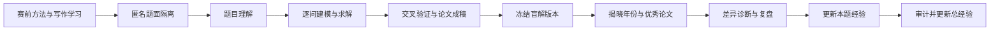

# CUMCM 盲解与复盘训练库

本仓库用于训练数学建模团队在不知道赛题年份、不了解当年优秀论文和既有解法的条件下，独立完成题目理解、逐问建模、求解验证、论文表达和揭晓后复盘。

## 核心原则

1. **先盲解，后揭晓**：盲解提交冻结前，不接触当年题解、当年论文或互联网搜索结果。
2. **逐问循环**：每一问都依次完成理解、候选模型、选型、求解、验证和记录，再进入下一问。
3. **证据优先**：不要求模型暴露不可审计的内部思维；要求记录假设、方案比较、选型依据、计算证据、失败原因和验证结果。
4. **保留历史**：阶段结论可以修订，但不得删除旧版本；所有关键更新写入更新记录。
5. **经验分层**：本题经验先在题目目录沉淀，经跨题验证后才写入总经验。
6. **防止污染**：往年优秀论文只用于学习表达规范、论证习惯和创新方式，不得复制段落、公式结构、图表设计或特定解法。

## 目录

- `题库/A题/2021` 至 `题库/A题/2025`：A 题及其逐年工作记录。
- `题库/B题/2021` 至 `题库/B题/2025`：B 题及其逐年工作记录。
- `题库/C题/2021` 至 `题库/C题/2025`：C 题及其逐年工作记录。
- `模型方法库/`：建模方法、算法、适用条件、诊断信号和验证清单。
- `参考论文/`：只存放非目标年份的写作学习材料及学习笔记。
- `总经验/`：跨题复用的团队经验、反例和变更日志。
- `prompts/`：按训练阶段使用的提示词。
- `docs/`：盲测隔离、完整实验流程和 GitHub 操作说明。
- `tools/`：题目匿名化、单题导出和仓库初始化工具。

## 正确的盲解方式

不要直接把本仓库根目录交给模型盲解。根目录包含年份目录，模型即使不联网也可能从路径和题目标题推断年份。

先从 `C:\Users\admin\OneDrive\Desktop\26国赛-盲解题库` 选择一个随机编号，再运行：

```powershell
.\tools\export_blind_problem.ps1 -BlindId A-K7M2
```

然后只把生成的 `C:\Users\admin\OneDrive\Desktop\26国赛-单题盲解区\A-K7M2` 作为新的 Codex 工作区。盲解结束并冻结后，再由管理员根据本地映射将记录归档回相应年份目录。

## 每题标准产物

每个年度题目目录都包含：

- `题目.pdf` 与 `附件/`
- `解题过程/00-任务状态.md`
- `解题过程/01-题目理解.md`
- `解题过程/02-逐问建模.md`
- `解题过程/03-求解与验证.md`
- `解题过程/04-结果与论文.md`
- `解题过程/05-优秀论文复盘.md`
- `解题过程/06-更新记录.md`
- `经验.md`
- `揭晓后参考/`

## 阶段门



只有完成前一阶段的验收清单并记录 Git 提交，才能进入下一阶段。
