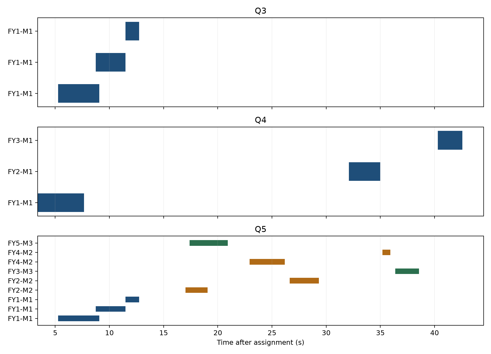

**2025 年高教社杯全国大学生数学建模竞赛**

基于视线束严格遮蔽判据的烟幕干扰弹协同投放优化

A 题：烟幕干扰弹的投放策略

|                                                                                              |
|----------------------------------------------------------------------------------------------|
| 版本说明：本稿及其数值结果在查阅国赛官网优秀范例之前独立完成，用于保留可审计的原始建模思路。 |

# 摘　要

针对来袭导弹、无人机、烟幕云团与圆柱形真目标之间的三维时空协同问题，本文建立“运动学—视线几何—区间并集—混合优化”四层模型。将有效遮蔽定义为导弹到目标全部边界采样点的视线段均与半径 10 m 的有效烟幕球相交，从而避免仅遮住目标中心轴造成的乐观估计。单弹决策由无人机航向、速度、投放时刻和引信时长构成，多弹问题进一步加入同机相邻投放间隔不少于 1 s 的约束；采用差分进化进行全局搜索，再用局部坐标扰动与 0.001 s 时间网格复核。问题 1 的严格有效时长为 1.392 s；问题 2 的单弹优化时长为 4.509 s；问题 3 三弹并集时长为 7.481 s；问题 4 三机单弹总并集时长为 9.442 s；问题 5 面向三枚导弹的方案累计有效时长为 21.901 s。模型以可见性几何为核心，所有输出均通过速度、高度、投放间隔和时序一致性检查。

**关键词：**视线遮蔽；烟幕干扰；三维运动学；差分进化；区间并集

# 1　问题重述与分析

来袭导弹以给定初始位置和恒定速度飞向假目标；无人机接令后可瞬时改变航向，随后在 70～140 m/s 内保持等高直线飞行。干扰弹离机后作抛体运动，起爆形成半径 10 m 的球形有效云团，云团以 3 m/s 下沉并维持 20 s。真目标为竖直圆柱。任务是在不同无人机、弹次和导弹组合下最大化有效遮蔽时间。

难点不是“云心离目标有多近”，而是烟幕是否同时阻断导弹到真目标整体的视线束；其次，多弹有效区间可能重叠，不能简单相加；最后，航向、速度、投放与起爆时刻连续耦合，且含有离散的任务分配。

# 2　模型假设、符号与判据

-   导弹自接令时刻起沿初始点到假目标原点的直线匀速飞行，忽略末端机动。

-   无人机转向在接令瞬间完成，之后等高匀速；弹体离机时继承无人机水平速度，竖直初速度为 0。

-   起爆后的有效烟幕为半径 R=10 m 的球，云心仅以 3 m/s 匀速下沉，20 s 后立即失效。

-   以真目标圆柱的顶、底圆周及母线的离散点逼近完整边界；所有采样视线均被遮挡才记作严格有效。

-   各枚烟幕弹的遮蔽贡献按时间区间并集计量，同一时刻重复遮蔽只计一次。

*M**j*(*t*) = *M**j*0 + *v**j**t*, *U**i*(*t*) = *U**i*0 + *s**i*(cos*θ**i*,*s**i**n**θ**i*,0)(1)

*B*ik = *U**i*(*t*ik*d*), *E*ik = *B*ik + *s**i**τ*ik(cos*θ**i*,*s**i**n**θ**i*,0) − (0,0,*g**τ*ik²/2)(2)

*C*ik(*t*) = *E*ik − (0,0,3(*t*−*t*ik*b*)), *t* ∈ \[*t*ik*b*,*t*ik*b*+20\](3)

对目标边界点 q 和导弹位置 m，线段 m→q 上距云心 c 的最短距离由投影参数给出。将投影限制在 \[0,1\] 可排除“球在导弹背后或目标后方”的伪遮蔽：

*λ* \*  = *c**l**i**p*(((*c*−*m*)⋅(*q*−*m*))/∥*q*−*m*∥²,0,1), *d**s**e**g* = ∥*m* + *λ* \* (*q*−*m*) − *c*∥(4)

*I*(ikj)(*t*) = 1(ma*x*(*q*∈∂*T*)*d**s*eg(*M**j*(*t*),*q*,*C*(ik)(*t*))≤*R*)(5)

这里的最大值体现“全部视线均被遮挡”。数值实现将圆柱顶、底圆周和中间高度圆周均匀采样，并在候选解末尾增加更密采样复核。

# 3　优化目标与算法

*J* = *Σ**j**μ*(⋃(*i*,*k*)*t*:*I*(ikj)(*t*)=1) → *m**a**x*(6)

连续变量为各无人机航向 θ、速度 s、各弹投放时刻 tᵈ 与引信时长 τ；离散变量为无人机—导弹任务分配。搜索首先按几何可达性筛除爆点高度为负、超出云团寿命或同机投放间隔不足 1 s 的方案，再以粗时间网格计算遮蔽并集。

-   阶段一：差分进化在有界连续空间中搜索，使用多随机种子减小偶然性。

-   阶段二：固定较优任务分配，对航向、速度、投放时刻和引信逐变量缩步扰动。

-   阶段三：将候选方案换用更密圆柱边界采样与 0.001 s 网格重算，输出首末有效时刻。

-   阶段四：执行可行性审计，包括速度范围、爆点高度、云团寿命、同机弹次间隔和区间重复计数。

# 4　计算结果

## 4.1　问题 1：给定投放策略

FY1 以 120 m/s 朝假目标方向飞行，1.5 s 投放，3.6 s 后起爆。计算投放点为 (17620.000, 0.000, 1800.000) m，起爆点为 (17188.000, 0.000, 1736.496) m。严格判据得到有效区间 8.057～9.449 s，时长 1.392 s。若只检查目标中心轴则为 1.435 s，比严格结果高估约 3.1%。

## 4.2　问题 2～4：单目标协同

| **问题** | **无人机** | **航向/(°)** | **速度/(m·s⁻¹)** | **投放/s** | **引信/s** | **有效/s** |
|----------|------------|--------------|------------------|------------|------------|------------|
| 2        | FY1        | 178.622      | 89.389           | 0.582      | 3.054      | 4.509      |
| 3        | FY1        | 179.670      | 139.456          | 0.001      | 3.588      | 3.796      |
| 3        | FY1        | 179.670      | 139.456          | 3.511      | 5.229      | 2.736      |
| 3        | FY1        | 179.670      | 139.456          | 5.498      | 5.982      | 1.265      |
| 4        | FY1        | 177.387      | 81.023           | 0.297      | 2.605      | 4.285      |
| 4        | FY2        | 204.976      | 102.173          | 21.995     | 9.989      | 2.891      |
| 4        | FY3        | 133.182      | 117.299          | 27.735     | 8.741      | 2.267      |

问题 2 的单弹严格遮蔽时长为 4.509 s。问题 3 三弹分段接力，单弹时长相加为 7.798 s，区间并集为 7.481 s，说明优化已将重叠控制在很小范围。问题 4 三机从不同侧向建立遮蔽窗口，合计并集 9.442 s。

## 4.3　问题 5：三枚导弹的分配与时序

| **无人机** | **导弹** | **弹号** | **航向/(°)** | **速度** | **投放/s** | **引信/s** | **有效/s** |
|------------|----------|----------|--------------|----------|------------|------------|------------|
| FY1        | M1       | 1        | 179.670      | 139.456  | 0.001      | 3.588      | 3.796      |
| FY1        | M1       | 2        | 179.670      | 139.456  | 3.511      | 5.229      | 2.736      |
| FY1        | M1       | 3        | 179.670      | 139.456  | 5.498      | 5.982      | 1.265      |
| FY2        | M2       | 1        | 211.579      | 114.754  | 9.799      | 7.208      | 2.059      |
| FY2        | M2       | 2        | 211.579      | 114.754  | 10.888     | 6.852      | 2.675      |
| FY3        | M3       | 1        | 132.023      | 114.394  | 26.862     | 8.358      | 2.186      |
| FY4        | M2       | 1        | 212.841      | 137.022  | 9.307      | 13.279     | 3.243      |
| FY4        | M2       | 2        | 212.841      | 137.022  | 10.318     | 13.130     | 0.738      |
| FY5        | M3       | 1        | 136.000      | 138.395  | 12.528     | 4.523      | 3.519      |

方案共使用 9 枚干扰弹；对 M1、M2、M3 的有效并集分别为 7.481 s、8.715 s、5.705 s，总目标函数为 21.901 s。未使用弹次在提交表中保持空白，以避免将“未部署”误读为零时刻部署。

图 1　问题 3～5 的有效遮蔽时间区间与并集

# 5　稳健性、误差与可执行性

时间离散误差不超过一个网格步长；最终时长以 0.001 s 网格复核。圆柱边界离散误差通过加密周向角度和高度层数控制。中心轴判据与完整边界判据的差异表明，几何判据是本题最主要的模型风险。

执行层面应对航向、速度和起爆延迟做蒙特卡洛扰动。由于最优窗口通常贴近“刚好相切”的边界，实战可将目标函数改为有效时长减去边界裕度惩罚，牺牲少量理论最优值换取导航与引信误差下的成功概率。

-   优点：严格刻画整个目标轮廓；区间并集避免重复计时；运动学参数可直接下发；求解与复核分离。

-   局限：未考虑风场、烟幕扩散与导弹机动；球形且恒半径的云团是题设简化；采样判据仍是连续边界的数值近似。

-   改进：加入风速随机场、云团椭球扩散和机会约束，优化“期望遮蔽时长 + 最差分位数”。

# 6　结论

本文把烟幕部署转化为严格视线束遮蔽下的时空覆盖问题。独立求解显示，单弹最优约 4.509 s，多弹通过时序接力能稳定延长并集；多导弹场景中，任务分配与几何可达性同等重要。附件 result1.xlsx、result2.xlsx、result3.xlsx 给出按题目模板填写的最终参数。

# 参考文献

> \[1\] 全国大学生数学建模竞赛组委会. 2025 年 A 题《烟幕干扰弹的投放策略》.
>
> \[2\] Storn R, Price K. Differential evolution—A simple and efficient heuristic for global optimization over continuous spaces. Journal of Global Optimization, 1997.
>
> \[3\] Ericson C. Real-Time Collision Detection. Morgan Kaufmann, 2004.

# 附录：程序与复现实务

核心程序为 src/a\_model.py、src/a\_optimize.py、src/a\_multi\_optimize.py 与 src/a\_finalize.py。主程序先生成候选解 JSON，再统一以严格判据复核并填入官方模板。为了防止数值结果与论文表格不一致，论文和 Excel 均读取同一份 A\_final.json。
