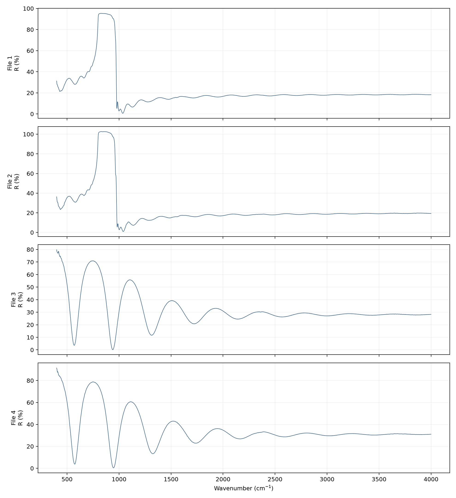
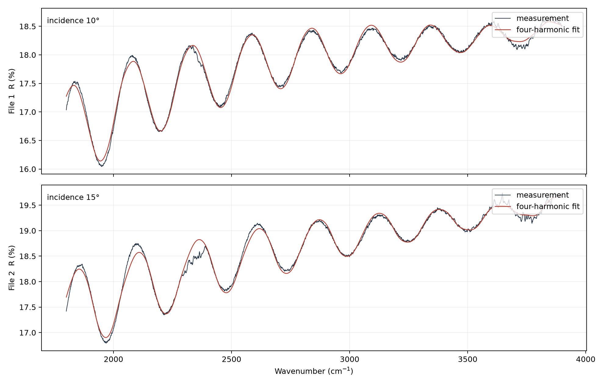
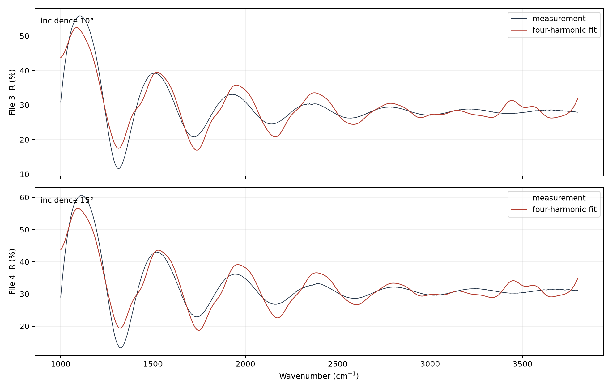

**2025 年高教社杯全国大学生数学建模竞赛**

基于色散相位回归与多光束诊断的外延层厚度测量

B 题：碳化硅外延层厚度的确定

|                                                                                              |
|----------------------------------------------------------------------------------------------|
| 版本说明：本稿及其数值结果在查阅国赛官网优秀范例之前独立完成，用于保留可审计的原始建模思路。 |

# 摘　要

针对碳化硅外延层红外反射谱厚度反演问题，本文从薄膜光程差出发，建立包含折射率色散和斜入射修正的相位—级次回归模型。对原始反射谱采用轻度平滑和显著峰识别，不依赖相邻峰的单一差分，而将全部峰序号与光学波数联合线性回归，并由回归斜率估计厚度及置信区间。附件 1、2 的碳化硅样品在 10°、15° 下得到 7.6965 μm 和 7.7106 μm，两角度平均后推荐 7.7036 μm；附件 3、4 的硅样品得到 3.4388 μm 和 3.3966 μm，推荐 3.4177 μm。进一步推导 Airy 多光束模型，以高次谐波/基波幅值比和信息准则判定多次反射影响。硅样品的高次谐波更明显，碳化硅样品亦有弱而不可忽略的多光束特征；采用峰位或多谐波公共相位估计可降低波形非正弦造成的厚度偏差。

**关键词：**红外干涉；薄膜厚度；折射率色散；Airy 模型；峰序回归

# 1　问题分析

反射谱中的周期振荡来自空气—外延层界面与外延层—衬底界面反射光之间的相位差。若折射率视为常数，可由相邻峰的波数间隔直接求厚度；但本题跨越较宽波段，折射率色散、基线漂移、吸收和多光束反射都会使峰间距发生变化。

本文将“峰位”视为比“峰高”更稳健的信息：先把色散并入光学波数，再用多个峰的级次回归估厚度；其后再以 Airy 模型检查高次反射是否会扭曲波形及峰位。两步分别回答厚度是多少、简单双光束假设是否足够。

# 2　数据预处理与两光束模型

-   读取波数—反射率两列，按波数升序排列；检查缺失、重复与间隔均匀性。

-   用 Savitzky–Golay 滤波抑制高频测量噪声，窗口远小于一个干涉周期，保留峰位。

-   利用峰显著度而非固定高度选峰，并在局部三点抛物线中细化峰位置。

-   对低频基线只作诊断；厚度主估计直接基于峰位，避免基线扣除参数改变答案。

*n*₀*s**i**n**θ*₀ = *n*₁(*ν*)*s**i**n**θ*₁, *δ*(*ν*) = 4*π**d**ν**n*₁(*ν*)*c**o**s**θ*₁ + *φ*₀(1)

$$m = 2d \\cdot \\nu \\cdot \\sqrt{}\\left( n₁\\left( \\nu \\right)² - sin²\\theta ₀ \\right) + c　　\\left( 2 \\right)$$

令 x=ν√(n₁(ν)²−sin²θ₀)，对连续峰序号 m=0,1,…作 m=βx+c 的最小二乘回归，则厚度 d=β/2。回归同时利用多个周期，可显著降低单对相邻峰误差。角度为外部入射角，折射率色散按材料的中红外经验公式计算。

*n*(SiC)²(*λ*) = 1 + 5.5515*λ*²/(*λ*²−0.026406)(3)

*n*(Si)²(*λ*) = 11.6858 + 0.939816/*λ*² + 0.00304347/*λ*⁴, *λ* = 10⁴/*ν*(μm)(4)

图 1　四组反射谱、平滑曲线与识别峰位

# 3　厚度估计结果

| **材料** | **附件** | **角度** | **峰数** | **厚度/μm** | **95% CI/μm**      | **R²**   |
|----------|----------|----------|----------|-------------|--------------------|----------|
| SiC      | 1        | 10°      | 9        | 7.6965      | \[7.6349, 7.7582\] | 0.999883 |
| SiC      | 2        | 15°      | 8        | 7.7106      | \[7.5927, 7.8285\] | 0.999635 |
| Si       | 3        | 10°      | 9        | 3.4388      | \[3.4056, 3.4721\] | 0.999878 |
| Si       | 4        | 15°      | 9        | 3.3966      | \[3.3622, 3.4310\] | 0.999867 |

同一碳化硅样品两角度结果仅相差 0.0141 μm（约 0.18%），推荐厚度取 7.7036 μm。硅样品两角度相差 0.0422 μm（约 1.23%），推荐厚度取 3.4177 μm。两组回归 R² 均接近 1，说明经过色散修正后，峰序与光学波数呈高度线性。

图 2　碳化硅样品的峰序—色散光学波数回归

图 3　硅样品的峰序—色散光学波数回归

# 4　多光束干涉的必要条件与判定

若外延层两界面保持近平行、光源相干长度超过往返光程，且单次往返后的场振幅衰减不大，则光在层内会发生多次反射。设往返场幅因子 q=√(R₀₁R₁₂)exp(−αd/cosθ₁)，多束叠加形成 Airy 型谱线：

*I*(*ν*) = *I**b*ase(*ν*) + *A*(*ν*)/\[1+*F**s**i**n*²(*δ*(*ν*)/2)\], *F* = 4*q*/(1−*q*)²(5)

当 q≪1 或光程差超过相干长度时，F 很小，Airy 函数退化为近似正弦的双光束模型；当 q 较大时，谱峰变尖并出现显著二次、三次谐波。本文在固定主相位下拟合四阶谐波，使用二次/一次谐波幅值比与 ΔAIC 诊断。

| **样品** | **10° 二/一谐波** | **15° 二/一谐波** | **结论**           |
|----------|-------------------|-------------------|--------------------|
| SiC      | 0.067             | 0.111             | 弱至中等多光束特征 |
| Si       | 0.143             | 0.108             | 多光束特征更明显   |

由于多光束主要改变波形尖锐度，而相邻同类极值仍受公共相位控制，峰序回归对多光束相对稳健。为进一步消除误差，可用多谐波共享同一 δ(ν) 的相位模型联合拟合，而不应把变尖的峰形强行拟合为单一余弦。

# 5　误差分析与可靠性

-   峰位误差：局部抛物线细化后，单峰误差远小于采样间隔；使用 8～9 个峰回归分摊误差。

-   折射率误差：厚度与有效折射率近似成反比，若 n 的相对误差为 ε，则 d 的一阶相对误差约为 −ε。

-   角度误差：10° 与 15° 独立估计一致，是对 Snell 修正和数据质量的交叉验证。

-   系统差异：硅样品两角度差异大于碳化硅，可能来自色散公式适用区间、入射角标定或多光束/吸收变化，应计入系统不确定度。

-   频段敏感性：建议滑动截取 70%～90% 频段重复拟合；若厚度稳定且残差无趋势，才报告最终值。

*u*²(*d*) ≈ *u*²*r**e**g* + (∂*d*/∂*n*⋅*u*(*n*))² + (∂*d*/∂*θ*⋅*u*(*θ*))²(6)

# 6　模型评价与结论

本文主模型以色散修正后的峰序回归确定厚度，计算透明、可重复、对基线和峰高变化不敏感；多光束模型用于检验假设并解释高次谐波。结果给出碳化硅外延层 7.7036 μm、硅样品 3.4177 μm。局限是折射率公式采用文献经验形式，尚未同时反演 n(ν)、吸收系数和界面粗糙度；若有透射谱或椭偏数据，可进行多源联合反演。

# 参考文献

> \[1\] 全国大学生数学建模竞赛组委会. 2025 年 B 题《碳化硅外延层厚度的确定》.
>
> \[2\] Born M, Wolf E. Principles of Optics. Cambridge University Press.
>
> \[3\] Macleod H A. Thin-Film Optical Filters. CRC Press.
>
> \[4\] Savitzky A, Golay M J E. Smoothing and differentiation of data by simplified least squares procedures. Analytical Chemistry, 1964.

# 附录：计算流程

源程序 src/b\_analysis.py 依次完成数据检查、谱线平滑、峰识别、色散相位回归、置信区间、四谐波拟合与绘图。厚度表和图由同一 results.json 生成，避免手工抄录误差。
