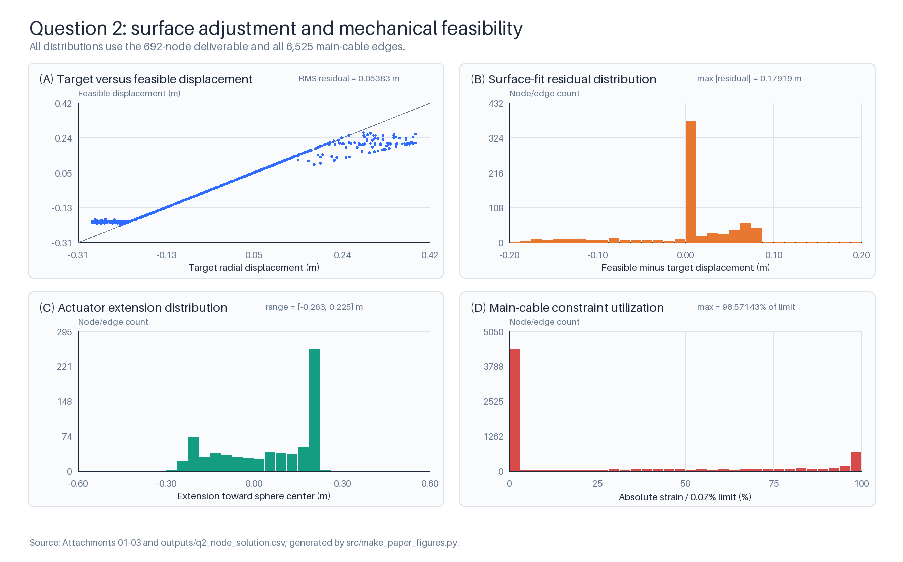
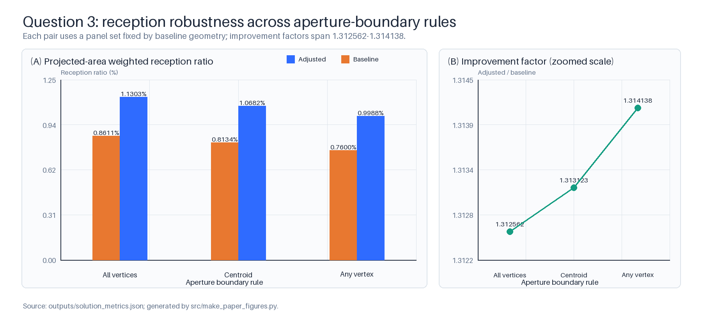

# 可调球面反射系统的受约束抛物面拟合与接收效果评估

> 盲解归档稿。本文只使用当前隔离工作区的题面、四个附件和自产计算结果；未读取题目年份映射、当年答案、题解或论文。本文给出严格可行的局部改进解，不声称非凸调节问题的全局最优性。

## 摘要

针对可调球面反射系统在不同观测方向下形成近似旋转抛物面的任务，本文依次解决理想面定位、受机械约束的节点调节以及馈源有效圆盘上的信号接收评价。首先，以附件节点模长均值 `R=300.400011 m` 作为与机构坐标自洽的球半径，建立统一视线坐标，并在保持馈源焦点不变的条件下，以顶点轴向位移 `h` 描述一族候选抛物面。随后把节点限制在基准径向射线上，逐条保留 6525 根主索的长度变化约束，通过“全局比例可行化—逐节点精确可行区间更新”求得严格可行的离散形面；促动量由附件实测轴和定长下拉索二次方程解析复算。最后，将每块三角面板的平行反射束仿射映射到馈源平面，以足迹三角形和半径 `0.5 m` 圆盘的交叠面积计算接收比例，并以入射投影面积加权。

天顶工况选得共享仪器设计参数 `h=-0.385 m`，理想顶点为 `(0,0,-300.785011) m`，机构可行形面的径向贴合 RMS 为 `0.048667 m`。在给定倾斜方向下，理想顶点为 `(-49.383238,-36.936661,-294.395316) m`，692 个工作口径节点的径向贴合 RMS 为 `0.053829 m`，最大主索相对变化为 `0.0690000%`，促动量范围为 `[-0.263432,0.225152] m`，全部硬约束均通过。主边界和投影面积口径下，调整后与基准态接收比分别为 `0.010681557` 和 `0.008134469`，相对提升 `31.3123%`。三种 300 米边界规则的提升因子位于 `1.312562–1.314138`；固定种子面积采样与解析接收比之差不超过 `8.95×10^-5`；六位小数交付后重新检查全部主索与促动器仍无超限。结果表明，该方法在不借助外部资料的条件下形成了几何、机构、光学和文件交付相互闭合的可复现方案，并明确量化了半径、方向、边界、权重和理想面参数的不确定性。

**关键词：** 可调反射面；旋转抛物面；机械约束；几何光学；足迹面积；可复现计算

## 1 题目重述

基准反射面由 2226 个主索节点和 4300 块三角面板构成，整体近似半径约 300 米、口径约 500 米的球面。工作时需调节其中约 300 米口径区域，使反射面尽量接近以观测方向为轴、以馈源舱接收中心为焦点的旋转抛物面。题面规定相邻节点距离相对基准值的变化幅度不超过 `0.07%`，促动器伸缩量在 `[-0.6,0.6] m` 内，促动器顶端与主索节点之间的下拉索长度保持不变。

需要完成三项任务：

1. 在天体位于正上方时确定理想抛物面的空间位置；
2. 在给定方位角 `36.795°`、仰角 `78.169°` 时，给出理想面顶点、300 米口径内节点坐标和对应促动量；
3. 以直径 1 米的馈源有效圆盘为接收区域，计算调整后接收比并与基准球面比较。

## 2 问题分析与总体路线

三问并非相互独立。第 1 问负责固定半径、焦点、顶点位移和抛物面表达；第 2 问把该设计旋转到给定视线方向，在主索、促动器和下拉索约束下求可行逼近；第 3 问再使用第 2 问的节点和面板几何计算反射足迹。总体数据链为

```text
题面参数与附件 1–3
        │
        ├─ 统一 R、F、角度、口径和焦点口径
        │
        ├─ 第1问：焦点固定的一参数理想抛物面族，选择共享 h
        │
        ├─ 第2问：目标径向位移 → 主索可行投影 → 实测促动轴/定长复算
        │                                      │
        │                                      └─ result.xlsx
        │
        └─ 第3问：面板法向 → 反射足迹 → 圆盘交叠 → 加权接收比
```

关键难点有三处：题面名义半径约 300 米而附件均值约 300.4 米；“尽量贴近”没有指定距离和聚合方式；第 3 问不能把一块约十米尺度的面板简化为一条质心射线，否则会严重高估直径 1 米圆盘的接收贡献。本文分别用半径敏感性、径向 RMS 目标和逐面板足迹面积积分处理这些问题。

## 3 模型假设

| 编号 | 假设 | 必要性与边界 |
|---|---|---|
| A1 | 天体足够远，300 米口径内入射波为方向一致、强度均匀的平行束 | 题面未给天体距离或空间强度分布；只用于几何光学接收比 |
| A2 | 同一状态下各面板反射率相同，材料损耗在接收比中消去 | 题面没有反射率数据；不讨论绝对功率 |
| A3 | 节点沿其基准球面径向射线运动，口径外节点保持基准坐标 | 与题面径向调节描述一致；边界跨区主索仍全部检查 |
| A4 | 促动器顶端沿附件 2 下端点至基准上端点的实测轴运动 | 该轴与题面径向轴最大偏角仅 `0.002376°`，是对径向描述的附件级实现 |
| A5 | 调整后每块面板按三个节点确定的平面三角形处理 | 附件只提供三顶点，未提供连续曲率、相位或材料参数 |
| A6 | 馈源圆盘所在平面过焦点且法向与抛物面轴一致 | 题面只给中心和直径；该假设使接收区域姿态唯一 |
| A7 | 主结果采用基准态面板质心定义 300 米边界，并固定同一面板集合比较两状态 | 避免调整前后分母集合漂移；另给两种边界敏感性 |

## 4 符号说明

| 符号 | 含义 | 单位 |
|---|---|---|
| `C` | 基准球面球心、坐标原点 | m |
| `R` | 主口径采用的基准球面半径 | m |
| `F` | 球面与焦面的半径差，`F=0.466R` | m |
| `α,β` | 方位角、仰角 | ° |
| `u` | 从球心指向天体的单位向量 | 1 |
| `ζ=q·u` | 点 `q` 的轴向坐标 | m |
| `ρ=||q-(q·u)u||` | 点到视线轴的距离 | m |
| `h` | 理想抛物面顶点相对基准球面底点的轴向位移 | m |
| `V,P,f` | 抛物面顶点、焦点、焦距 | m |
| `q_i^0,q_i` | 节点 `i` 的基准、调整后坐标 | m |
| `e_i,d_i` | 节点基准径向单位向量、径向位移 | 1，m |
| `d_i^*` | 节点射线与理想面交点对应的目标径向位移 | m |
| `E,l_{ij}^0,l_{ij}` | 主索边集、基准和调整后边长 | —，m |
| `b_i,t_i^0,e_i^a` | 促动器下端、基准上端和朝球心实测单位轴 | m，m，1 |
| `δ_i,L_i` | 促动器伸缩量、定长下拉索长度 | m |
| `T_k,n_k` | 第 `k` 块三角面板及其单位法向 | —，1 |
| `k,r_k` | 入射和反射单位方向 | 1 |
| `γ_k,w_k` | 面板足迹落入圆盘的面积比例、投影面积权重 | 1，m² |
| `η` | 馈源接收比 | 1 |

## 5 数据预处理与统一口径

### 5.1 数据结构

附件 1 和附件 2 均为 2226 行，节点编号集合和顺序完全一致；附件 3 含 4300 个三角面板。每个三角形的三条边无向去重后得到 6525 条主索，与题面数量一致。后续始终保存每条主索自己的基准长度，不用平均边长代替。

附件 1 节点到原点的模长范围为 `300.399289–300.400686 m`，均值 `R=300.400011121543 m`。

主结果采用该均值，因为它与机构坐标自洽；名义 `R=300 m` 只作整条计算链的敏感性对照。由此 `F=0.466R=139.986405183 m`。

### 5.2 坐标与角度

方位角从 `+x` 朝 `+y` 为正，仰角从 `xy` 平面向 `+z` 为正：

`u=(cosβ cosα, cosβ sinα, sinβ)`。

第 1 问有 `u_1=(0,0,1)`；第 2 问有 `u_2=(0.164181179,0.122800870,0.978756602)`。

工作节点以基准坐标满足 `ρ_i≤150 m` 选取，因此第 1 问含 706 个节点，第 2 问含 692 个节点。口径外节点固定，但全部跨边界主索仍进入 6525 条全量约束。

### 5.3 焦点与共同设计参数

馈源中心位于反射面一侧的焦面交点：`P=-(R-F)u`。

本文把第 1 问选出的 `h` 解释为同一台仪器的焦点一致理想面设计；第 2 问仅旋转该设计，而不针对每个方向重新设计。因此共享 `h` 是物理一致性口径，不声称它是第 2 问单独求得的局部最优参数。第 2 问独立选参只作为敏感性给出。

## 6 第 1 问：天顶理想抛物面

### 6.1 焦点固定的一参数抛物面族

令顶点与焦距分别为 `V=(-R+h)u`，`f=F-h`。则 `V+fu=-(R-F)u=P`，即改变 `h` 时焦点仍固定。以 `ζ=q·u`、`ρ` 为轴向和轴外坐标，旋转抛物面方程为

`ρ²=4f(ζ+R-h)`。

与固定顶点或自由改变焦比相比，该参数化只增加一个有明确机构意义的轴向自由度，同时保持题面给定的馈源位置。

### 6.2 理想节点与贴近目标

记 `q_i^0=r_i^0e_i`、`||e_i||=1`，并限制节点在该径向射线上：`q_i=(r_i^0+d_i)e_i`。

设 `a_i=e_i·u`，射线与理想面的正半径交点为

`s_i=8f(R-h)/[-4fa_i+sqrt(16f²a_i²+16f(R-h)(1-a_i²))]`，

故目标位移 `d_i^*=s_i-r_i^0`。主贴近指标取工作节点上的未加权径向 RMS：

`J(h,d)=sqrt[(1/N)Σ_{i∈A}(d_i-d_i^*)²]`。

另以隐式曲面梯度归一化后的近似法向距离复核，避免只报告单一距离口径。

### 6.3 参数选择与结果

在 `h∈[-0.45,-0.25] m` 上先以 `0.005 m` 粗扫，再在最优点附近以 `0.00125 m` 细扫。每个候选 `h` 都先完成主索可行化，再比较径向 RMS，未使用第 2、3 问结果反向校准。

选得 `h=-0.385 m`，因而：

- 顶点 `V_1=(0,0,-300.785011) m`；
- 焦点 `P_1=(0,0,-160.413606) m`；
- 焦距 `f=140.371405 m`。

706 个工作节点的可行形面径向 RMS 为 `0.048667490 m`，最大绝对误差 `0.174313948 m`，近似法向 RMS 为 `0.048662259 m`。最大主索相对变化为 `0.000690000000001`，最大绝对促动量为 `0.248530806 m`，均未超限。

基线对照表明：若固定 `h=0` 并直接把节点放到目标面，会有 1770 条主索和 270 个促动器超限；即使采用 `h=-0.385 m`，不做主索投影的直接目标仍有 975 条主索超限。因此“理想面定位”和“机构可行逼近”不能合并为一次直接投影。

## 7 第 2 问：倾斜工况下的受约束形面调节

### 7.1 机械约束

对所有主索边 `(i,j)∈E`，要求 `|l_{ij}/l_{ij}^0-1|≤0.0007`。

内部工作阈值取 `0.00069`，为六位小数交付保留舍入余量。口径外 `d_i=0`，口径内节点仍沿基准径向运动。

### 7.2 全局可行化与逐节点精确区间更新

先对全部目标位移做统一比例缩放 `d=λd^*`，二分得到满足所有主索约束的严格可行起点。固定相邻节点时，一条主索的上下长度限可转化为当前 `d_i` 的精确一维可行区间；对节点所有邻边区间求交，再把 `d_i^*` 裁剪到交集。循环更新至单轮最大变化小于 `10^-11 m`。

比较正序、逆序、按目标残差降序、按目标残差升序和固定种子随机序五种更新顺序，每个候选都以三维坐标重新计算全部边长，最终按径向 RMS 最小者选取。第 2 问采用逆序候选。该算法从严格可行点出发且每一步保持一维约束，但不构成非凸问题的全局最优性证明。

### 7.3 促动器与定长下拉索

记附件 2 下端点和基准上端点为 `b_i,t_i^0`，实测朝球心轴为 `e_i^a=(t_i^0-b_i)/||t_i^0-b_i||`。

顶端调整为 `t_i=t_i^0+δ_ie_i^a`，下拉索长度 `L_i=||q_i^0-t_i^0||=||q_i-t_i||`。

令 `w_i=q_i-t_i^0`，则促动量满足

`δ_i=(e_i^a·w_i)±sqrt[(e_i^a·w_i)²-(||w_i||²-L_i²)]`。

取绝对值较小且与基准态 `δ_i=0` 连续的根。实测轴相对径向近似的最大偏角为 `0.002375569°`；692 个有效节点的促动量最大差仅 `1.842686×10^-6 m`。因此径向近似不改变结论，但正式交付采用附件实测轴。

### 7.4 结果

第 2 问焦点为 `P_2=(-26.336895,-19.698930,-157.005876) m`，理想顶点为 `V_2=(-49.383238,-36.936661,-294.395316) m`。

| 指标 | 数值 |
|---|---:|
| 工作节点数 | 692 |
| 目标径向位移范围 | `[-0.283528,0.389946] m` |
| 可行径向位移范围 | `[-0.225152,0.263432] m` |
| 径向贴合 RMS | `0.053829111 m` |
| 径向最大绝对误差 | `0.179190292 m` |
| 近似法向 RMS | `0.053820579 m` |
| 最大主索相对变化 | `0.000690000000002` |
| 促动量范围 | `[-0.263432144,0.225152401] m` |
| 最大定长残差 | `2.84×10^-14 m` |
| 主索/促动器超限数 | `0/0` |

图 1 展示目标到可行形面的收缩、贴面残差、促动量和全部主索约束利用率。最大约束利用率为题面上限的 `98.57143%`，与内部 `0.00069` 工作阈值一致。



*图 1　第 2 问形面调节与机械可行性。图中文字使用英文，以避免运行环境中文字体缺失；数据来自附件 1–3 和 `outputs/q2_node_solution.csv`。*

### 7.5 共享设计的敏感性

若允许第 2 问在相同离散网格独立选择 `h`，得到 `h=-0.39625 m`、径向 RMS `0.053491951 m`，比共享设计改善 `0.000337160 m`（`0.6264%`），顶点沿轴相差 `11.25 mm`。主方案仍保留共享 `h=-0.385 m`，因为其含义是同一台仪器的理想面设计随观测方向旋转，而非每次观测重新设计仪器。

## 8 第 3 问：馈源圆盘接收比

### 8.1 面板反射方向

入射方向为 `k=-u`。对面板三个调整后顶点 `q_a,q_b,q_c`，取

`n_k=[(q_b-q_a)×(q_c-q_a)]/||(q_b-q_a)×(q_c-q_a)||`，

反射方向为 `r_k=k-2(k·n_k)n_k`。法向正负不改变反射方向。

### 8.2 馈源平面足迹

馈源平面定义为过焦点 `P` 且法向为 `u` 的平面，有效区域是该平面内半径 `0.5 m` 的圆盘。平面三角面板上的平行入射光经反射后仍相互平行。对面板顶点 `q_{kj}`，与馈源平面的交点参数为

`τ_{kj}=[(P-q_{kj})·u]/(r_k·u)`，

映射点为 `y_{kj}=q_{kj}+τ_{kj}r_k`。三个映射点形成足迹三角形 `T'_k`。令

`γ_k=Area(T'_k∩A_f)/Area(T'_k)`，

其中交叠面积用解析圆—三角形裁切积分计算，而不是把面板质心命中视为整块面板全部被接收。

### 8.3 信号权重和主口径

面板的入射投影面积权重为 `w_k=0.5|[(q_b-q_a)×(q_c-q_a)]·u|`。

主面板集合 `B` 由基准态面板质心满足 `ρ≤150 m` 定义，并固定用于调整前后。接收比为

`η=Σ_{k∈B}w_kγ_k / Σ_{k∈B}w_k`。

两状态使用相同方向、焦点、圆盘、权重和面板集合，因而比值具有可比性。

### 8.4 主结果

| 状态 | 面板数 | 投影面积分母（m²） | 接收加权面积（m²） | 接收比 |
|---|---:|---:|---:|---:|
| 调整后 | 1374 | 70502.132883 | 753.072522 | 0.010681557 |
| 基准态 | 1374 | 70447.677780 | 573.054484 | 0.008134469 |

调整后的绝对提升为 `0.002547087`，即 `0.254709` 个百分点；相对提升为 `31.3123%`，提升因子 `1.313123`。调整后有 1338 块面板足迹与圆盘存在非零交叠，基准态为 1260 块；所有非零交叠均为部分交叠。

早期质心二元近似给出调整后/基准态 `0.111427/0.049148`，约比逐面板足迹结果高一个数量级。原因是质心命中时把整块面板权重计入，而实际只有足迹的一小部分落入半径 `0.5 m` 的圆盘，故该近似只保留为失败基线。

### 8.5 300 米边界稳健性

| 基准态固定边界规则 | 面板数 | 调整后 | 基准态 | 提升因子 |
|---|---:|---:|---:|---:|
| 三顶点均在内 | 1295 | 0.011302974 | 0.008611386 | 1.312562 |
| 质心在内（主结果） | 1374 | 0.010681557 | 0.008134469 | 1.313123 |
| 任一顶点在内 | 1474 | 0.009987976 | 0.007600403 | 1.314138 |

图 2 表明边界规则会改变绝对接收比，但三种成对提升因子仅相差约 `0.12%`（相对量），调整优于基准的方向稳定。



*图 2　三种口径边界规则下的接收比和提升因子。每组调整/基准值使用同一基准态面板集合；数据来自 `outputs/solution_metrics.json`。*

## 9 验证、敏感性与误差传播

### 9.1 机构和交付验证

- 全精度复查全部 6525 条主索、692 个有效节点及其 692 个促动器；主索、行程、二次方程判别式和定长下拉索全部通过。
- 六位小数交付后，用导出坐标重新计算全部边：最大相对变化 `0.000690094647`，仍小于 `0.0007`，超限数为 0。
- 六位小数促动量最大绝对值为 `0.263432 m`，超限数为 0；最大下拉索残差 `1.137244×10^-6 m`，最大径向舍入偏差 `7.765109×10^-7 m`。
- `result.xlsx` 含三个原模板工作表，数据区尺寸为 `2×3`、`693×4`、`693×2`；顶点、692 个节点、692 个促动器与机器 JSON 全值一致，公式错误扫描为 0，视觉检查无裁切且保持六位小数。

### 9.2 几何光学验证

- 4 个解析抛物面测试点的反射线到焦点最大偏差为 `5.68×10^-14 m`。
- 圆—三角形交叠算法在“三角形完全在圆内、圆完全在三角形内、完全相离”三种极端情形下最大面积误差为 `8.67×10^-19 m²`。
- 固定种子 `20260902`、每块面板 512 个均匀面积样本的独立验证中，调整后采样比 `0.010660422`，与解析值相差 `2.11×10^-5`；基准态采样比 `0.008044966`，相差 `8.95×10^-5`。
- 主口径投影面积相对 `π·150²` 的覆盖率为调整后 `99.7401%`、基准态 `99.6631%`，与离散边界预期一致。

### 9.3 参数和结构敏感性

| 变化项 | 第2问径向 RMS（m） | 调整后接收比 | 相对主结果 |
|---|---:|---:|---:|
| 主口径 `R=300.400011 m,h=-0.385 m` | 0.053829 | 0.010681557 | — |
| 名义 `R=300 m`，重新选 `h=-0.766261 m` | 0.055814 | 0.010626773 | -0.51% |
| `h=-0.395 m` | 0.053548 | 0.010702826 | +0.20% |
| `h=-0.375 m` | 0.055238 | 0.010668585 | -0.12% |
| 方位角镜像 `y→-y` | 0.053102 | 0.010695307 | +0.13% |
| 方位轴互换 `x↔y` | 0.051425 | 0.010676391 | -0.05% |

把投影面积权重换成实际面积或等面板权重时，调整后接收比分别为 `0.010551432` 和 `0.010673166`，相对主结果约为 `-1.22%` 和 `-0.08%`。基准球面解析法向给出 `0.008715351`，调整后理想抛物面解析法向给出 `0.011585740`；二者用于量化面板局部法向假设，不作为主结果的直接替代。

### 9.4 误差传播链

1. **半径与焦面：** `R` 直接决定 `F=0.466R`、焦点 `P` 和理想面位置。将附件自洽半径改为名义 300 米并重新选参后，接收比变化 `-0.51%`，给出了该系统误差的端到端量级。
2. **共享 `h`：** 第 1 问的 `h` 传递到第 2 问目标位移。第 2 问独立选参只把 RMS 改善 `0.000337 m`，说明共享仪器设计有可量化但较小的贴合代价。
3. **节点到面板法向：** 主索约束和目标误差共同决定节点位置，节点位置再通过叉积决定面板法向和反射足迹。六位小数舍入后的径向偏差小于 `7.77×10^-7 m`，未触发任何机械约束，故交付舍入不构成主导误差。
4. **边界和权重：** 边界规则主要影响分母面积和绝对接收比；固定集合成对比较后，提升因子稳定在 `1.312562–1.314138`。权重替代造成的调整后接收比变化不超过约 `1.22%`。
5. **面板连续性：** 平面三角形近似、未建模曲率/相位/衍射是难以由现有附件消除的结构误差。解析法向对照显示它可能影响绝对接收比，因此结论应限于本文的几何光学面板模型，不外推为真实系统绝对效率。

## 10 模型评价

### 10.1 优点

1. 三问共享同一坐标、半径、焦点、角度和口径定义，前后接口清晰。
2. 把理想面与机构可行逼近分开，避免“直接投到抛物面即视为可调”的错误。
3. 逐条检查 6525 根主索和全部相关促动器，并为交付舍入预留确定性约束裕度。
4. 第 3 问采用逐面板足迹面积而非质心二元近似，并用解析极端情形与固定种子面积采样双重验证。
5. 关键歧义均有替代口径或敏感性，所有随机过程固定种子，工作簿和图表可由正式入口复现。

### 10.2 局限

1. 坐标区间更新给出严格可行的局部改进解，但没有非凸全局最优证明。
2. 节点径向运动和实测促动轴之间虽只差微小角度，仍是对真实机构的简化。
3. 面板按平面三角形处理，未建模真实连续曲率、反射率、相位、衍射和馈源方向图。
4. 300 米边界采用离散面板规则，没有对跨边界面板进行连续圆盘裁切。
5. 主结果使用附件均值半径；若工程定义强制采用名义 300 米，应切换到已给出的整链敏感性方案。

## 11 复现说明

### 11.1 环境与命令

随机种子为 `20260902`。验证环境为 bundle `26.826.12353`：Python `3.12.13`、NumPy `2.3.5`、pandas `3.0.1`、Pillow `12.3.0`；工作簿使用 loader 提供的 Node.js 与 `@oai/artifact-tool`。

在工作区根目录依次运行：

```powershell
& 'C:\Users\leo\.cache\codex-runtimes\codex-primary-runtime\dependencies\python\python.exe' '.\src\solve_all.py'
& 'C:\Users\leo\.cache\codex-runtimes\codex-primary-runtime\dependencies\python\python.exe' '.\src\make_paper_figures.py'
& '.\src\build_result.ps1' -NodePath 'C:\Users\leo\.cache\codex-runtimes\codex-primary-runtime\dependencies\node\bin\node.exe' -NodeModulesPath 'C:\Users\leo\.cache\codex-runtimes\codex-primary-runtime\dependencies\node\node_modules'
```

`build_result.ps1` 为裸包导入建立一次性模块目录连接，并在成功或失败时通过 `finally` 清理，不提交 `node_modules`。

### 11.2 机器输出与哈希

本阶段从正式入口复跑一次，四个机器输出与返修冻结基线逐字节一致：

| 文件 | SHA-256 |
|---|---|
| `outputs/solution_metrics.json` | `b33fffcb78642ebbb16f41067e0e1d8e85b4d47163ef8ef84fb3ea903f200d0a` |
| `outputs/result_data.json` | `2c83c7cc8ddcb7c4d091d539ee3109812519eacd47cbbfdc420e8880cfc68c96` |
| `outputs/q2_node_solution.csv` | `a1c6935fab7277ef1fb1cbbc104a206d3d46908bffd65d65d13ffbc38fb24190` |
| `outputs/q3_panel_diagnostics.csv` | `ad2954c9fe1cebe5120b889b4d895df7972d5ef09fea8237029d0a8e73afbf62` |

当前 `result.xlsx` 的 ZIP 字节 SHA-256 为 `1d83f6c43cc13430c02ada8fb1c2c63f614751b9475ec81b655592bace06e551`；打包元数据可能使重复导出的字节哈希变化，因此以三张工作表名称和全部单元格值规范化后的语义 SHA-256 `870253b4abab00160c2ddb4787dd5716f4dc05928bd87806466e2bc7d2ecaee9` 作为内容稳定性证据。

两幅论文图由同一脚本生成：

| 文件 | SHA-256 |
|---|---|
| `figures/figure1_surface_constraints.png` | `8d6a71209644710aa6cc44c143dff6e6245dbcab46d7fe9426613789e6658dd6` |
| `figures/figure2_reception_boundaries.png` | `3a227dd292f9535963c06b168c8efb8cbb169b68c78b10892122fa74a5dd2b85` |

## 12 结论与盲解冻结建议

本文给出了一套从理想面、可行调节到馈源接收的闭环盲解。主方案在全部机械约束下将倾斜工况形面径向 RMS 控制为 `0.053829 m`，并使本文几何光学口径下的接收比相对基准提高 `31.3123%`。边界、半径、角度、权重、法向和共享设计参数的对照均未改变“调整后优于基准态”的结论方向。

建议以本阶段提交作为盲解论文冻结候选，但在正式冻结前保留以下未解决项：非凸问题缺少全局最优证明；跨口径面板尚未连续裁切；真实面板曲率、材料损耗、相位、衍射和馈源方向图没有数据支撑；精确模型标识与推理强度仍待用户确认。这些问题不影响当前题面和附件口径下的可复现性，但限制了结果向真实系统绝对效率的外推。

## 参考资料声明

本稿未引用任何外部文献。唯一资料来源为：

1. 当前隔离工作区 `题目.pdf`；
2. `附件/附件01.csv`、`附件/附件02.csv`、`附件/附件03.csv`、`附件/附件04.xlsx`；
3. 本任务根据上述输入自产的源码、机器输出和验证记录。

未读取题目年份映射、当年答案、题解、优秀论文、外部数据库或互联网资料；尚未进行揭晓后复盘。

## 版本修订记录

- **初始结果登记：** 修改前本文件为空模板；逐问建模阶段登记了三问关键结果、模型优缺点和可复现材料，并明确摘要、正文和论文图表未开始。
- **独立复核有界返修：** 补充共享 `h` 的物理选择、第 2 问独立选参敏感性、三种边界成对结果和工作簿包装入口；正式促动量改按附件 2 实测轴复算。
- **本次论文成稿：** 修改前为结果登记和论文占位；修改后形成摘要、题目重述、分析、假设、符号、三问推导与算法、结果、验证、敏感性、误差传播、优缺点、复现说明、参考资料声明和盲解冻结建议，并加入两幅由机器输出生成的科学图表。
- **修改原因：** 用户明确授权进入“全局校验与论文成稿”阶段；本次仍未读取当年论文或答案，也未进入揭晓后复盘。

## 盲解冻结标记

- 冻结时间：`2026-09-02 15:27:09 +08:00`。
- 冻结基线：阶段 5 提交 `2e63e2f0eb1f7dae7828e084876cd4e5cb5e384c`；独立验收为 `PASS`，无 P0/P1/P2。
- 冻结内容：本文正文（除本冻结标记外）、正式源码、四个机器输出、两幅科学图、`result.xlsx` 和题面输入均已复核未变；四个正式输出及工作簿语义哈希沿用第 11.2 节记录。
- 不可变更规则：禁止修改、覆盖、变基或强制重写冻结基线及冻结记录提交；后续揭晓后分析必须另起提交，并明确与本盲解版本隔离。
- 保留局限：非凸问题无全局最优证明；跨边界面板未连续裁切；真实面板曲率、损耗、相位、衍射和馈源方向图无数据；模型精确标识与推理强度待用户确认。
