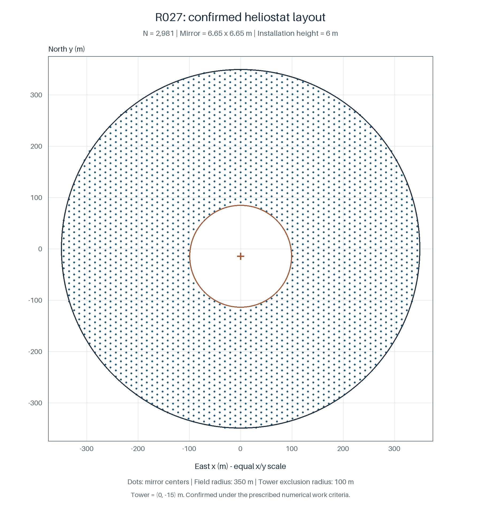
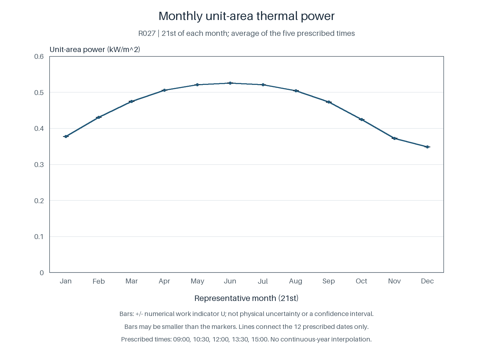

# 第2问：统一尺寸定日镜场的参数化设计与热功率评价

## 1 问题分析

第2问要求在统一镜面尺寸和安装高度的条件下，确定吸收塔位置、定日镜宽高、安装高度、镜数及各镜面的位置，使年平均输出热功率达到额定要求，并使单位镜面面积的年平均输出热功率尽可能大。相较于第1问，镜场的几何结构由给定输入变为设计变量；镜数变化同时改变总采光面积、潜在障碍集合以及其他镜面的接收贡献。

设计中的几何量与光学量相互影响。塔位改变镜面的瞄准方向和反射传播距离，也改变塔周禁布区域；镜面尺寸改变采光面积、有限边界和镜间遮挡；安装高度改变镜面姿态、传播路径及离地条件。因此，不能将第1问的平均效率按新面积或镜数直接放大。每个候选均须展开为完整镜场，在全部镜面互相遮挡的条件下重新评价。

镜数为整数，位置变量随镜数变化，裁剪和遮挡又使目标具有不光滑性。为控制有限计算条件下的搜索规模，采用由少量公共参数生成完整布局的环带表示，先在有界参数集合内进行比较，再对冻结设计作独立确认。参数化限定了可搜索的布局集合，其中仍须检查几何和功率可行性；有限搜索不提供原问题的全局最优性保证。

初轮受控搜索没有得到满足额定工作判据的候选，其中总功率评分最高的 C22 也在独立确认中判为未达标。由此采用分层目标：首先在完整60时点评价下修复额定功率可行性；只有候选通过固定的搜索筛选条件后，才在保留可行基线的同时比较单位面积年平均热功率。该筛选条件只决定候选的比较与冻结资格，不能替代冻结设计的独立确认。

## 2 基本假设、符号与统计口径

### 2.1 共同光学假设

沿用第1问的东、北、上坐标系和代表日历。太阳位置按365日非闰年计算，以3月21日为第0天；将题给当地时间直接代入时角公式，不另作民用时修正。每月21日的9:00、10:30、12:00、13:30、15:00构成60个规定时点。以下“年平均”均指这60个时点的等权平均，不表示连续全年的能量积分。

光源采用轴对称、按立体角均匀的硬截止圆锥，半角为 \(\beta=0.00465\,\mathrm{rad}\)。该分布为第1问已采用的近似，不是当地太阳辐射的实测分布。每面镜视为零厚度、双面不透明的有限平面矩形，进行单次理想反射，反射率取 \(\rho=0.92\)。集热器仍为中心高度80 m、直径7 m、高8 m的有限圆柱；仅侧面作为有效受光面，顶底面为不透明、非受光端面。

未给出尺寸的塔身、支架和厂房不建立实体，未给出参数的跟踪误差、坡度误差、散射和镜间二次反射不另行加入。沿用这些假设是为了保持不同设计的评价口径一致，不表示所省略的实际损失为零。第1问的物理定义可以复用，但其特定镜场的数值误差和验证范围不能转移为新设计的精度保证。

### 2.2 决策变量与主要符号

设塔位为 \(\boldsymbol a=(a_x,a_y)\)，镜面宽度、高度和镜心安装高度分别为 \(w,h,z\)，第 \(i\) 面镜的平面位置为 \(\boldsymbol p_i=(x_i,y_i)\)。完整设计记为

\[
\mathcal D=
\left(\boldsymbol a,w,h,z,N,\{\boldsymbol p_i\}_{i=1}^{N}\right),
\qquad
\boldsymbol c_i=(x_i,y_i,z),\qquad
\boldsymbol c_R=(a_x,a_y,80).
\tag{1}
\]

其中，\(N\) 是实际保留的镜数，全部长度以米计。所有镜面的共同面积和总镜面面积分别为

\[
A_i=wh,\qquad A_{\rm tot}=Nwh.
\tag{2}
\]

表S2　本问主要符号

| 符号 | 含义 | 单位 |
|---|---|---|
| \(\boldsymbol a,w,h,z\) | 塔位、镜宽、镜高、镜心安装高度 | m |
| \(N,\boldsymbol p_i,A_{\rm tot}\) | 实际镜数、镜位、总镜面面积 | 1、m、m² |
| \(\boldsymbol c_i,\boldsymbol c_R\) | 镜面中心与集热器中心 | m |
| \(\boldsymbol s_{0k},\boldsymbol s\) | 指向太阳中心和光源采样方向的单位向量 | 1 |
| \(\boldsymbol t_i,\boldsymbol n_{ik}\) | 中心瞄准方向与镜面单位法向 | 1 |
| \(\boldsymbol u_{ik},\boldsymbol v_{ik}\) | 镜面宽边与高边的单位方向 | 1 |
| \(\mathrm{DNI}_k,c_{ik},\tau_i\) | 法向直接辐照度、中心余弦因子、大气透射率 | kW/m²、1、1 |
| \(S,B,R\) | 未遮阴、反射段未遮挡、有效侧面接触的指示量 | 1 |
| \(\Pi_{0,ik},\Pi_{1,ik},\Pi_{2,ik}\) | 基准反射、联合存活和有效接收三层功率 | kW |
| \(P_k,\overline P,\overline q\) | 逐时总功率、年平均总功率、年平均单位面积功率 | kW、kW、kW/m² |
| \(\boldsymbol\vartheta\) | 布局生成参数 | 依分量而定 |
| \(U_Q,L_P\) | 汇总量的数值工作指标、年平均功率工作下限 | 与相应量相同 |

第1问给定的镜数、镜位和安装参数不作为本问的固定条件。场地圆心始终位于坐标原点，塔位改变时不能将场地一同平移。

## 3 优化模型与几何约束

### 3.1 原目标及额定功率条件

记 \(\eta_{ik}(\mathcal D)\) 为第 \(i\) 面镜在时点 \(k\) 的总光学效率。逐时全场热功率为

\[
P_k(\mathcal D)=\mathrm{DNI}_k\,wh\sum_{i=1}^{N}\eta_{ik}(\mathcal D),
\qquad
\overline P(\mathcal D)=\frac1{60}\sum_{k=1}^{60}P_k(\mathcal D).
\tag{3}
\]

将“达到额定功率”解释为年平均总热功率下限，建立模型

\[
\begin{aligned}
\max_{\mathcal D}\quad&
\overline q(\mathcal D)=\frac{\overline P(\mathcal D)}{Nwh},\\
\text{满足}\quad&
\overline P(\mathcal D)\ge60000\ \mathrm{kW},\\
&\mathcal D\in\mathcal F_{\rm geom}.
\end{aligned}
\tag{4}
\]

其中，\(\mathcal F_{\rm geom}\) 为下节定义的几何可行集。额定条件作用于规定时点的平均值，不要求每个时点均达到额定值；镜数为整数，允许总热功率在下限之上取值。

单位面积目标必须保留比值形式。仅当比较设计的总镜面面积相同时，最大总功率才与最大单位面积功率等价；仅当总功率被固定为相同数值时，最小总面积才与该目标等价。式（4）只设置功率下限，因而不能用最大总功率、最少镜数或最小总面积替换原目标。特别地，增删镜面会改变其余镜面的遮挡条件，总功率不具有可直接假定的镜数单调性。

### 3.2 中心边界与全对间距

场界和塔周禁布区均按镜面中心位置判断，塔中心位于固定圆形场地内。间距要求中的“以上”取为包含等号。几何可行集满足

\[
\begin{aligned}
&\|\boldsymbol a\|\le350,\qquad
\|\boldsymbol p_i\|\le350, &&i=1,\ldots,N,\\
&\|\boldsymbol p_i-\boldsymbol a\|\ge100, &&i=1,\ldots,N,\\
&\|\boldsymbol p_i-\boldsymbol p_j\|\ge w+5,
&&1\le i<j\le N,\\
&2\le w\le8,\qquad2\le h\le8,\qquad2\le z\le6,
\qquad z>h/2,\qquad N\in\mathbb Z_{>0}.
\end{aligned}
\tag{5}
\]

中心边界是本模型采用的解释，不等同于全部转动姿态下完整镜面投影都位于场地内。禁布圆随塔位移动，但不额外要求整个禁布圆内含于场地。镜间距作用于所有不同镜对，不能以同环相邻点或清单相邻行的检查代替。

宽边沿用始终水平的姿态定义。镜面最低点为

\[
z_{\min,ik}=z-\frac h2|v_{ik,z}|.
\tag{6}
\]

对全部俯仰转角要求不触地时，\(|v_{ik,z}|\) 可达到1，因此采用严格条件 \(z>h/2\)。宽度不进入该竖直跨度，不能以半对角线代替 \(h/2\) 而不说明新增限制。数值检查中的近边界报告阈值只用于定位对象，不将负间距余量或零离地余量判为满足要求。

有限搜索另取 \(w\ge h\)，对应题面关于通常宽高关系的说明。这是搜索范围限制，不是明确给定的独立尺寸硬约束。宽高在水平姿态、中心间距和触地条件中的作用不同，交换两个符号不能证明这一搜索限制不影响最优值。

## 4 复用的光学评价模型

### 4.1 新设计中的镜面姿态与接收边界

太阳中心方向和DNI沿用第1问的题给公式。对新的镜心和集热器中心，重新计算

\[
\begin{aligned}
\boldsymbol t_i&=\frac{\boldsymbol c_R-\boldsymbol c_i}
{\|\boldsymbol c_R-\boldsymbol c_i\|},\\
\boldsymbol n_{ik}&=\frac{\boldsymbol s_{0k}+\boldsymbol t_i}
{\|\boldsymbol s_{0k}+\boldsymbol t_i\|},\\
\boldsymbol u_{ik}&=\frac{(-n_{ik,y},n_{ik,x},0)}
{\sqrt{n_{ik,x}^2+n_{ik,y}^2}},\qquad
\boldsymbol v_{ik}=\boldsymbol n_{ik}\times\boldsymbol u_{ik}.
\end{aligned}
\tag{7}
\]

仅在法向两个水平分量严格为零时，将宽边规定为向东，近竖直情形仍使用式（7）。新设计是否触发退化情形由各自的域检查确定。有限镜面上的点为

\[
\boldsymbol x=\boldsymbol c_i+\xi\boldsymbol u_{ik}+\zeta\boldsymbol v_{ik},
\qquad
-w/2\le\xi\le w/2,\quad-h/2\le\zeta\le h/2.
\tag{8}
\]

指向光源的单位向量为 \(\boldsymbol s\) 时，入射传播方向为 \(-\boldsymbol s\)，反射方向为

\[
\boldsymbol r=-\boldsymbol s+2(\boldsymbol s\cdot\boldsymbol n_{ik})\boldsymbol n_{ik}.
\tag{9}
\]

镜面相交须同时满足正向射线参数和有限矩形边界。塔位改变后，集热器侧面平移为 \((X-a_x)^2+(Y-a_y)^2=3.5^2\)、\(|Z-80|\le4\)。按最小正向参数确定首次实体接触，仅首次接触为侧面且方向指向实体内部时计入接收。切触、接缝和机器容差带内的不确定交点保留状态，不通过扩张实体强制归类。

### 4.2 路径事件与三层功率

从镜面点向光源回查，入射路径没有其他镜面或集热器实体遮阴时记 \(S=1\)；反射路径在终止之前未被其他镜面截住时记 \(B=1\)；接收体首次接触为有效外入侧面时记 \(R=1\)。有效接收对应联合事件 \(SBR=1\)，从而避免将重叠损失重复扣除。

未命中集热器的反射路径沿用接收体包围球后切平面作为终点：

\[
(\boldsymbol x-\boldsymbol c_R)\cdot\boldsymbol t_i=R_b,
\qquad R_b=\sqrt{3.5^2+4^2}.
\tag{10}
\]

若路径先接触实体，则在首次接触处终止。终止参数必须为正。式（10）是阴影遮挡与截断分项的记账约定，不是新增障碍，也不使分项成为唯一的物理分解。

以第1问相同的均匀立体角分布抽取方向，以镜面实际面积均匀抽取源点。令

\[
g_{ik}(\boldsymbol s)=
\frac{\boldsymbol n_{ik}\cdot\boldsymbol s}{\boldsymbol s_{0k}\cdot\boldsymbol s},
\qquad c_{ik}=\boldsymbol n_{ik}\cdot\boldsymbol s_{0k}.
\tag{11}
\]

在整个角域满足正面、地平线及参考面投影条件时，轴对称分布给出 \(\mathbb E[g_{ik}]=c_{ik}\)。三层反射功率定义为

\[
\begin{aligned}
\Pi_{0,ik}&=\rho\,\mathrm{DNI}_k\,wh\,c_{ik},\\
\Pi_{1,ik}&=\rho\,\mathrm{DNI}_k\,wh\,\mathbb E[g_{ik}SB],\\
\Pi_{2,ik}&=\rho\,\mathrm{DNI}_k\,wh\,\mathbb E[g_{ik}SBR].
\end{aligned}
\tag{12}
\]

三者分别表示基准反射功率、联合阴影遮挡后的存活功率和有效接收面捕获功率，均尚未乘入大气透射率。分母为正时，效率分解为

\[
\eta_{{\rm sb},ik}=\frac{\Pi_{1,ik}}{\Pi_{0,ik}},\qquad
\eta_{{\rm trunc},ik}=\frac{\Pi_{2,ik}}{\Pi_{1,ik}},\qquad
\eta_{ik}=\rho c_{ik}\tau_i\eta_{{\rm sb},ik}\eta_{{\rm trunc},ik}.
\tag{13}
\]

大气透射率按新传播距离计算：

\[
\tau_i=0.99321-0.0001176d_i+1.97\times10^{-8}d_i^2,
\qquad d_i=\|\boldsymbol c_R-\boldsymbol c_i\|\le1000\ \mathrm m.
\tag{14}
\]

于是 \(P_{ik}=\tau_i\Pi_{2,ik}=\mathrm{DNI}_kwh\eta_{ik}\)。反射率、入射投影和大气透射各计一次，不附加反平方因子、接收面余弦或热电转换因子。输出热功率继续采用题目附录的有效受光面接收口径，未另计接收器吸收、再辐射、对流及换热损失。

### 4.3 固定总体汇总与适用性检查

对月份 \(m\) 的五个时点组成集合 \(\mathcal K_m\)，有

\[
\begin{aligned}
\overline P_m&=\frac15\sum_{k\in\mathcal K_m}P_k,
&\overline q_m&=\frac{\overline P_m}{Nwh},\\
\overline e_m&=\frac1{5N}\sum_{k\in\mathcal K_m}\sum_{i=1}^{N}e_{ik},
&\overline e&=\frac1{60N}\sum_{k=1}^{60}\sum_{i=1}^{N}e_{ik}.
\end{aligned}
\tag{15}
\]

这里的 \(e_{ik}\) 为已定义的单镜效率分量或总效率。总效率必须先逐镜、逐时形成，再取平均；不能用各平均分量相乘代替。月度及年平均功率同样不能由平均DNI乘平均效率得到。能量总量比与平均条件效率另行区分。

每个新设计均检查完整光源圆锥、镜面正面、目标方向、接收体有限边界、终止面正向性及大气公式适用域。完整布局的全部镜子始终参与潜在障碍集合。几何筛选只剔除不可能相交的对象，不以少量评价镜代替镜场总体，也不通过固定近邻数量截断遮挡查询。

## 5 两种环带参数化

### 5.1 圆环与半开扇区表示

圆环族以塔为生成中心，采用环半径、角域、整数计数和相位作为布局参数。设第 \(\ell\) 环的半径为 \(r_\ell\)，角域为 \([\theta_\ell^-,\theta_\ell^+)\)，名义点数为 \(m_\ell\)，相位比例为 \(\sigma_\ell\in[0,1)\)。当 \(m_\ell>0\) 时，生成点为

\[
\begin{aligned}
\theta_{\ell j}
&=\theta_\ell^-+\frac{j+\sigma_\ell}{m_\ell}
(\theta_\ell^+-\theta_\ell^-),
&&j=0,\ldots,m_\ell-1,\\
\widetilde{\boldsymbol p}_{\ell j}
&=\boldsymbol a+r_\ell(\cos\theta_{\ell j},\sin\theta_{\ell j}).
\end{aligned}
\tag{16}
\]

角域采用半开区间，避免完整圆周两端重复。实际圆环搜索取完整角域，其表达能力小于任意扇区组合或自由镜位集合。

为给构造留出正间距余量，令 \(d_* =w+5+\varepsilon\)，并采用径向、角向间距系数 \(f_r,f_\theta\ge1\)。径向间隔至少为 \(f_rd_*\)，角向弦长目标为 \(f_\theta d_*\)。当角向目标不大于直径时，完整环的计数采用

\[
m_\ell=
\left\lfloor
\frac{\pi}{\arcsin\!\left(f_\theta d_*/(2r_\ell)\right)}
\right\rfloor.
\tag{17}
\]

计算后还须检查实际弦长是否达到目标；若浮点取整使弦长略低于目标，则减少计数，不能以容差增加计数。径向差至少为 \(w+5\) 是保证跨环间距的充分条件，并非题目强制的最密布局条件。该构造限制了圆环族的密度，不能据其搜索表现否定更灵活的环带布局。

### 5.2 六扇区直边层带

为扩大有限环带表示的结构范围，增加六扇区直边层带。该表示由同心正六边形边界构成，属于新增的分区生成族；同层各点到塔的欧氏距离并不相同，因而不能视为式（16）中改变一个圆环半径所得的特例。

设公共间距为 \(d_*=w+5+\varepsilon\)，公共旋转角为 \(\phi\)，定义

\[
\boldsymbol b_s=d_*
\left(\cos\left(\phi+\frac{s\pi}{3}\right),
\sin\left(\phi+\frac{s\pi}{3}\right)\right),
\quad s=0,\ldots,5,\qquad\boldsymbol b_6=\boldsymbol b_0.
\tag{18}
\]

第 \(\ell\) 层、第 \(s\) 条边取

\[
\widetilde{\boldsymbol p}_{\ell sj}
=\boldsymbol a+(\ell-j)\boldsymbol b_s+j\boldsymbol b_{s+1},
\quad \ell\ge1,\quad s=0,\ldots,5,\quad j=0,\ldots,\ell-1.
\tag{19}
\]

每边排除末端点，由下一边包含该顶点，因此完整第 \(\ell\) 层有 \(6\ell\) 个互异点。不同正整数层的六边形边界不重合。所有层共享同一平移中心、旋转角和格距，镜位由公共参数整体确定，不设置逐点独立的保留变量。

任意两个不同生成点之差都可写成 \(a\boldsymbol b_0+b\boldsymbol b_1\)，其中 \((a,b)\) 是非零整数对。由于两基向量夹角为 \(60^\circ\)，有

\[
\|\Delta\boldsymbol p\|^2
=d_*^2(a^2+ab+b^2)
=d_*^2\left[\left(a+\frac b2\right)^2+\frac{3b^2}{4}\right]
\ge d_*^2.
\tag{20}
\]

式（20）同时覆盖同层、跨层和跨扇区点对，不依赖只检查相邻边。该性质要求公共基底不变，不能直接推广到逐层独立旋转或缩放的构造。

第 \(\ell\) 层的欧氏半径满足

\[
\frac{\sqrt3}{2}\ell d_*
\le\|\widetilde{\boldsymbol p}_{\ell sj}-\boldsymbol a\|
\le\ell d_*.
\tag{21}
\]

为覆盖可能进入固定场地的层，实际生成器采用保守上限

\[
K=\left\lceil
\frac{350+\|\boldsymbol a\|}{(\sqrt3/2)d_*}
\right\rceil+1.
\tag{22}
\]

随后逐点裁剪。若直接把圆环的顶点半径截止规则用于六边形，会漏掉部分外层边中点；式（22）避免这一遗漏。几何上较紧密的排布不自动意味着较高总功率或单位面积功率，其光学表现仍由完整评价决定。

### 5.3 裁剪、实际镜数与稳定身份

对任一生成族，用 \(\mathcal J(\boldsymbol\vartheta)\) 表示名义槽位集合。按中心场界和禁区保留

\[
\mathcal I(\boldsymbol\vartheta)=
\left\{j\in\mathcal J(\boldsymbol\vartheta):
\|\widetilde{\boldsymbol p}_j\|\le350,
\quad\|\widetilde{\boldsymbol p}_j-\boldsymbol a\|\ge100
\right\},
\qquad N(\boldsymbol\vartheta)=|\mathcal I(\boldsymbol\vartheta)|.
\tag{23}
\]

名义计数不等于实际镜数。裁剪只删除点，不降低保留点之间原有的距离；但边界和计数变化会使面积与目标发生跳变。镜场清单展开后，独立于生成规则检查全部无序镜对、中心边界、禁区、尺寸和严格离地条件，重复身份及重复坐标均不得作为不同镜面接受。

生成槽位键、内部镜号和导出行号分别保存。稳定身份指同一生成槽位的对应关系，不表示不同设计中的物理坐标相同。镜面排序、导出行号或读入来源不能代替布局身份；设计的有效几何、公共参数及生成记录共同绑定后续评价。

## 6 有界搜索、可行性修复与独立确认方法

### 6.1 搜索参数集合与评价层级

初轮搜索比较了圆环族与六扇区直边层带族，所得总功率最高候选仍未通过式（29）的额定功率工作判据。在不改变式（1）—（23）几何、光学和统计定义的条件下，可行性修复集中于六扇区直边层带族。起始参数取塔位 \((0,0)\)、安装高度6 m、旋转角 \(\pi/6\)、正间距余量0.05 m，并分别以6.75 m和7 m正方形镜面展开完整镜场。后续候选仅在表S3所列的有界集合内调整，且每次调整后重新裁剪镜场、确定实际镜数并检查全部无序镜对。

表S3　可行性修复搜索的参数边界（长度单位：m）

| 参数 | 取值范围或局部调整 |
|---|---|
| 镜面宽高 | \(2\le h\le w\le8\)；围绕父候选作0.05、0.10、0.15、0.25或0.50的局部调整，可联动宽高或仅调整高度 |
| 安装高度 | 优先保持 \(z=6\)；在预设分支中可比较 \(z=5.5\) |
| 塔位 | \(\lvert a_x\rvert\le30\)，\(-60\le a_y\le30\)；局部位移采用15 m或30 m步长 |
| 带族旋转角 | \(0,\ \pi/12,\ \pi/6\) |
| 正间距余量 | 0.01或0.05；仅为数值搜索限制，不解释为工程净空 |

为避免只在少量代表时点上筛掉潜在可行设计，修复搜索的各评价层级均覆盖题目规定的全部60个时点，只改变独立批数和每批射线数。表S4中的相关前缀与完整样本共享随机数，仅用于层级差诊断，不作为额外独立样本。

表S4　可行性修复与独立确认的冻结数值层级

| 用途 | 时点范围 | 独立批数 | 每批每镜每时点射线数 | 相关前缀 | 随机流命名空间 |
|---|---|---|---|---|---|
| 低样本全时点候选发现 | 全部60个规定时点 | 2 | 16 | 8 | 1900 |
| 较精全时点候选比较 | 全部60个规定时点 | 4 | 64 | 32 | 1910 |
| 冻结设计独立确认 | 全部60个规定时点 | 8 | 256 | 128 | 1990 |

搜索目标采用先可行、后效率的分层次序。在尚无候选通过较精层筛选阈值时，按完整60时点的年平均总功率点估计安排候选，并同时保留单位面积功率。对较精层候选，定义搜索保留量

\[
\begin{aligned}
G_P&=\widehat{\overline P}-
\max\!\left\{50\ \mathrm{kW},\ 2\max\!\left[
t_{3,0.975}\widehat{\mathrm{SE}}_{P},
\left|\widehat{\overline P}-\widehat{\overline P}_{1/2}\right|,
\left|\widehat{\overline P}-\widehat{\overline P}_{\rm raw}\right|
\right]\right\},\\
t_{3,0.975}&=3.182446305.
\end{aligned}
\]

只有全部必需点估计均可定义且 \(G_P>60000\ \mathrm{kW}\) 时，候选才进入可行基线集合。出现这样的候选后，保留总功率可行基线，并按单位面积年平均热功率比较其余通过筛选的候选，且至少评价一个面向单位面积目标的局部调整或互补设计。该筛选量仅用于搜索阶段抵御有限样本波动，不是置信区间，也不替代式（28）、式（29）的独立确认标准。

低样本层出现池化零存活时，相应固定总体汇总量保持未定义；另存的有限样本启发式功率只用于安排较精比较，不能据此宣称候选达标或给出正式评级。较精层仍有必需未决状态的候选不进入可行基线，也不能通过删对象、删时点、重换随机种子或填零消除未决状态。任何新增样本都构成新的评价层级，不能追溯性地改变已保存层级的状态。不同候选的点估计差异若未超过配对批次诊断的数值分辨能力，也不能写成已经确立的性能改进。

### 6.2 原始加权统计与共同随机数

随机积分同时在镜面面积和光源立体角上抽样。四个独立的 \([0,1)\) 均匀变量可生成

\[
\xi=w(U_1-1/2),\qquad\zeta=h(U_2-1/2),\qquad
\mu=\cos\beta+(1-\cos\beta)U_3,\qquad
\psi=2\pi U_4.
\tag{24}
\]

其中 \(\mu\) 是相对太阳中心方向的极角余弦，\(\psi\) 是方位角。逐镜、逐时保存 \(g\)、\(gSB\)、\(gSBR\) 的加权和、平方和、事件计数及状态。对互不重复的独立批次先池化原始统计，记三和为 \(M_0,M_1,M_2\)，再计算

\[
\begin{aligned}
\widehat f_1&=M_1/M_0,\qquad\widehat f_2=M_2/M_0,\\
\widehat\eta_{\rm sb}&=\widehat f_1,\qquad
\widehat\eta_{\rm trunc}=M_2/M_1,\qquad
\widehat\eta_{ik}=\rho c_{ik}\tau_i\widehat f_2.
\end{aligned}
\tag{25}
\]

式（25）适用于相应正分母和可定义状态，不对每批比值先取平均。原始积分 \(M_\ell/n_{\rm tot}\) 与采用解析尺度的自归一比例分开保存，其中 \(n_{\rm tot}\) 为当前重建实际纳入的互不重复批次在每个对象—时点上的总样本数；完整确认时 \(n_{\rm tot}=B_0\times256\)，相关前缀和删批重建则按各自实际纳入的批次与样本数更新。两种积分形式用于差异诊断；有限样本下自归一比值仍可能有偏。

共同随机数按生成位置键、标准时点和批号建立对应，在共享槽位上使用相同的标准化源点和方向变量。同一槽位的实际坐标可以变化，故这一关系表示采样配对，而非相同物理镜面。不同生成族没有自然对应槽位时，不声称所有镜面完全配对。候选间相关性不能按独立重复样本处理。

零存活和零命中分别保留。抽样零不自动成为真实零证书；没有有效独立证据时，不能将正式分项或总量静默填为0或1。若固定总体的某个必需分项仍未定义，则相应平均值保留未决状态，不通过删除镜面、删除时点或更换随机种子补齐。

### 6.3 实际交付清单的冻结与重建

布局在首次光学评分前即按10位小数形成坐标表示，并重新检查几何。候选选择结束后，保存公共参数和逐镜设计清单，写入附件所需字段，再从工作簿读取实际数值，核对镜数、共同参数、全对几何、总面积及内部身份到导出序号的映射。独立确认使用读回后的设计，避免评价高精度内存坐标而交付另一套坐标。

紧凑记录将公共参数和生成元数据保存一次，逐镜CSV仅保存导出序号、内部身份、位置键和坐标；浮点序列化采用17位有效数字。公共文件、逐镜文件和清单摘要相互绑定，允许脱离搜索器内存独立重建设计。导出行与读入来源作为追溯信息保留，不因来源变化将同一有效设计判为另一物理输入。

在独立确认开始前，固定实际设计、评价模型、采样批次、随机流、工作指标和停止规则。确认结果不能反过来调整设计后继续沿用同一确认结论，搜索数据也不并入最终确认点估计。

冻结后的独立确认仅改变时点任务的调度方式：4个工作进程分别接收完整时点，每个任务仍计算全镜场和完整障碍集合，并沿用按稳定位置身份建立的随机流、原光学核与原始统计池化。以既有 R023 数据在首、末两个规定时点进行串并行同射线核对，原始加权和、交叉和、事件计数、未知权重、余弦量、大气透射量、面积及所查射线事件均一致。该检查支持所测时点的调度等价性，不是新的光学验证，也不保证完整确认的运行速度。并行作业的壁钟时间从进程启动、等待到读写完成只计一次，各工作进程的CPU时间另行保存。

### 6.4 独立批次与数值工作指标

确认采用表S4中的8个等量独立批次，每批每组合256条射线。128条相关前缀只用于层级比较，不作为新增独立样本重复池化。最终估计只使用冻结后的确认数据。

对某一月度或年度汇总量 \(Q\)，用 \(\mathcal T\) 表示从原始统计到题定汇总的同一重建函数，第 \(b\) 批原始统计记为 \(\mathcal S_b\)。定义

\[
\widehat Q=\mathcal T\!\left(\sum_{b=1}^{B_0}\mathcal S_b\right),
\qquad
\widehat Q_{(-b)}=\mathcal T\!\left(\sum_{j\ne b}\mathcal S_j\right),
\qquad B_0=8.
\tag{26}
\]

删去一整批时，同时删除该批覆盖的全部镜面和时点统计，以保留共享随机数产生的依赖关系。相应刀切标准误为

\[
\widehat{\mathrm{SE}}_Q=
\sqrt{\frac{B_0-1}{B_0}\sum_{b=1}^{B_0}
\left(\widehat Q_{(-b)}-\frac1{B_0}\sum_{j=1}^{B_0}\widehat Q_{(-j)}\right)^2}.
\tag{27}
\]

设 \(\widehat Q_{128}\) 为相关前缀重建值，\(\widehat Q_{\rm raw}\) 为原始加权积分重建值。确认工作指标为

\[
U_Q=
\max\left\{
t_{7,0.975}\widehat{\mathrm{SE}}_Q,
|\widehat Q-\widehat Q_{128}|,
|\widehat Q-\widehat Q_{\rm raw}|
\right\}+U_{Q,\rm low}.
\tag{28}
\]

低存活项 \(U_{Q,\rm low}\) 对确认池化后未加权联合存活数小于100的对象—时点组合计算。令 \(F_{ik}=\rho c_{ik}\tau_i\)，对这些对象—时点组合，阴影遮挡和截断分量采用范围直径1，总效率采用 \(F_{ik}\)，单镜功率采用 \(\mathrm{DNI}_kwhF_{ik}\)；确定的余弦分量不增加该项。将各对象—时点组合的范围直径按式（3）、（15）的固定总体权重汇总，单位面积功率再除以实际总面积。若有效几何证书已确定某一分量，则只移除该已确定维度的影响量，不能由局部证书消除所有误差。

式（28）的近似批间半宽、相关层级差、原始积分差和低存活影响量共同构成数值工作指标。它不是覆盖所有比值偏差的严格界，不保证多个表项同时达到统计覆盖率，也不包括光学假设和省略实体造成的物理误差。全时点搜索比较只提供点估计、删批标准误及状态，不直接输出式（28）的正式达标评级。

### 6.5 数值确认条件

对月度和年度所需效率表项，要求 \(U_Q\le0.001\)；对总功率和单位面积功率表项，要求工作指标相对值不大于0.005，并要求相关量及工作指标可定义。额定功率采用

\[
L_P=\widehat{\overline P}_{\rm conf}-U_{\overline P},
\qquad L_P\ge60000\ \mathrm{kW}.
\tag{29}
\]

只有清单与几何检查有效、能量及事件统计一致、必需状态可定义、全部规定精度条件满足且式（29）成立时，才将冻结设计判为通过数值确认。工作下限不足或精度不满足时不能借显示舍入认定达标；关键状态未解决时应保留未决结论。即使通过上述条件，结论也只对应冻结设计和所采用的模型及数值标准。

## 7 结果分析与验证

### 7.1 搜索结果与设计清单

可行性修复实际评价了 R023—R027 共5个低样本候选，均采用完整镜场和全部60个规定时点。除表S5所列塔位和宽高外，5个候选的安装高度均为6 m，带族旋转角均为 \(\pi/6\)，正间距余量均为0.05 m。记 \(P_h,q_h\) 为低样本文件另存的启发式功率评分；它们不属于固定总体的正式点估计。

表S5　低样本全时点候选及启发式评分

| 候选 | 塔位（m） | 镜面宽×高（m） | 镜数 \(N\) | 总面积（m²） | \(P_h\)（kW） | \(q_h\)（kW/m²） | 抽样零存活组合数 | 必需未定义位置数 | 固定总体状态 |
|---|---|---|---:|---:|---:|---:|---:|---:|---|
| R023 | \((0,0)\) | 6.75×6.75 | 2952 | 134500.5000 | 60501.034 | 0.449820 | 2 | 15 | 未定义；仅启发式 |
| R024 | \((0,0)\) | 7.00×7.00 | 2802 | 137298.0000 | 60107.021 | 0.437785 | 3 | 20 | 未定义；仅启发式 |
| R025 | \((0,0)\) | 6.65×6.65 | 2988 | 132136.8300 | 60143.894 | 0.455164 | 4 | 20 | 未定义；仅启发式 |
| R026 | \((0,0)\) | 6.75×6.70 | 2952 | 133504.2000 | 60350.344 | 0.452048 | 2 | 15 | 未定义；仅启发式 |
| R027 | \((0,-15)\) | 6.65×6.65 | 2981 | 131827.2725 | 60169.308 | 0.456425 | 4 | 20 | 未定义；仅启发式 |

五个低样本候选均有2—4个池化抽样零存活组合，未知状态数均为0。抽样零使总效率、总功率和单位面积功率等必需固定总体量出现未定义位置，因此表S5的 \(P_h,q_h\) 只能用于选择较精评价对象，不能据其超过60000 kW就判定额定功率可行。

低样本比较后，对启发式总功率较高的 R023 与启发式单位面积功率较高的 R027 进行4批×64条射线的较精全时点评价。两者的抽样零、未知状态和必需未定义位置数均为0。表S6列出的“筛选通过”只表示满足第6.1节的搜索保留条件；全时点比较本身不输出正式额定评级。

表S6　较精全时点候选比较

| 候选 | 镜数 \(N\) | 总面积（m²） | \(\widehat{\overline P}\)（kW） | \(\widehat q\)（kW/m²） | 功率刀切标准误（kW） | 单位面积功率刀切标准误（kW/m²） | 筛选扣减量（kW） | 搜索筛选 |
|---|---:|---:|---:|---:|---:|---:|---:|---|
| R023 | 2952 | 134500.5000 | 60506.279 | 0.449859 | 4.969 | \(3.694\times10^{-5}\) | 50.0 | 通过 |
| R027 | 2981 | 131827.2725 | 60165.183 | 0.456394 | 5.074 | \(3.849\times10^{-5}\) | 50.0 | 通过 |

保存的配对批次比较给出年度差 \(R027-R023\)：总功率为 \(-341.097\) kW，单位面积功率为 \(+0.006535\) kW/m²；相应 \(t_3\) 近似点态半宽分别为3.661 kW和 \(2.782\times10^{-5}\) kW/m²。因此，在所用共同随机数和较精样本层级下，R027 的单位面积功率点估计优势大于该数值波动诊断。该比较形成于搜索之后，未经选择效应校正，也不是物理误差或同时置信保证。

R023 的总功率点估计较高，R027 的单位面积功率点估计较高。两者均通过搜索筛选后，按“先满足功率筛选、再比较单位面积功率”的顺序冻结 R027。读回后的冻结设计参数为塔位 \((0,-15)\) m、镜面宽高6.65 m×6.65 m、安装高度6 m、旋转角 \(\pi/6\)、镜数2981、总面积131827.2725 m²。在搜索阶段，这一选择只说明 R027 是已评价的有限参数集合内单位面积功率较高的候选；其额定功率状态须由下节独立确认，且有限搜索不提供全局最优性保证。

参数搜索与候选清单冻结的累计作业壁钟时间约为2384.09 s；该口径包含初始化、恢复和读写，不等同于纯光学内核时间。后段串行积分的用时明显增加，但原因尚未验证，因此该观测不能外推为稳定的单时点或全场计算速度。

### 7.2 独立确认与正式结果

R027 的独立确认采用未参与搜索的命名空间1990、8个独立批次和每批256条射线，128条相关前缀用于式（28）的层级差。完整计算覆盖2981面镜与60个规定时点形成的178860个对象—时点组合，共使用366305280个源样本；相关前缀和后续重建不重复计入该样本数。池化后178860个组合均为可估计状态，抽样零、未知状态和必需未定义位置数均为0。

确认得到年平均总功率

\[
\widehat{\overline P}_{\rm conf}=60157.7837\ \mathrm{kW},
\qquad
U_{\overline P}=4.5146\ \mathrm{kW},
\qquad
L_P=60153.2690\ \mathrm{kW}.
\]

由于 \(L_P>60000\ \mathrm{kW}\)，额定功率工作判据通过。单位镜面面积年平均输出热功率为0.4563379 kW/m²，其工作指标为 \(3.4246\times10^{-5}\) kW/m²。全部78个题表精度项均达到第6.5节的数值目标，确认结论为通过。该结论只针对冻结的 R027、既定光学模型和式（28）、式（29）的数值标准；前轮 C22 的确认样本未并入 R027 的估计。

正式题表由确认数据生成，并从 CSV 与 result2 工作簿逐项读回。表中数值为便于阅读作显示舍入，状态判定和精度检查均使用未舍入值。

表1　R027 每月21日的平均光学效率及输出热功率

| 日期 | 平均光学效率 | 平均余弦效率 | 平均阴影遮挡效率 | 平均截断效率 | 单位面积镜面平均输出热功率（kW/m²） |
|---|---:|---:|---:|---:|---:|
| 1月21日 | 0.4321 | 0.7284 | 0.7499 | 0.9385 | 0.3773 |
| 2月21日 | 0.4558 | 0.7464 | 0.7691 | 0.9301 | 0.4303 |
| 3月21日 | 0.4771 | 0.7642 | 0.7843 | 0.9215 | 0.4747 |
| 4月21日 | 0.4912 | 0.7792 | 0.7888 | 0.9169 | 0.5055 |
| 5月21日 | 0.4985 | 0.7869 | 0.7890 | 0.9163 | 0.5209 |
| 6月21日 | 0.5009 | 0.7891 | 0.7892 | 0.9164 | 0.5256 |
| 7月21日 | 0.4983 | 0.7868 | 0.7891 | 0.9162 | 0.5206 |
| 8月21日 | 0.4906 | 0.7786 | 0.7886 | 0.9169 | 0.5043 |
| 9月21日 | 0.4760 | 0.7633 | 0.7835 | 0.9221 | 0.4725 |
| 10月21日 | 0.4530 | 0.7441 | 0.7670 | 0.9310 | 0.4242 |
| 11月21日 | 0.4298 | 0.7269 | 0.7477 | 0.9395 | 0.3721 |
| 12月21日 | 0.4181 | 0.7205 | 0.7338 | 0.9448 | 0.3482 |

表2　R027 年平均光学效率及输出热功率

| 年平均光学效率 | 年平均余弦效率 | 年平均阴影遮挡效率 | 年平均截断效率 | 年平均输出热功率（MW） | 单位面积镜面年平均输出热功率（kW/m²） |
|---:|---:|---:|---:|---:|---:|
| 0.4684 | 0.7595 | 0.7733 | 0.9258 | 60.158 | 0.4563 |

表3　R027 定日镜场设计参数

| 吸收塔位置坐标（m） | 定日镜尺寸（宽×高）（m） | 定日镜安装高度（m） | 定日镜总面数 | 定日镜总面积（m²） |
|---|---:|---:|---:|---:|
| \((0,-15)\) | \(6.65\times6.65\) | 6.00 | 2981 | 131827.2725 |

图1　R027 定日镜中心布局及场界

图1中的点表示镜面中心，不表示镜面占地轮廓。外圆是以场地原点为中心、半径350 m的镜心布置边界；内圆以实际塔位 \((0,-15)\) m为中心、半径100 m，表示塔周镜心禁布区。横纵坐标采用相同比例，图中的“确认”仅表示该设计通过本文预先规定的数值工作判据。

图2　R027 各规定月样本的单位面积平均输出热功率

图2的每个点是当月21日五个规定时刻的平均值，连线仅用于辨认12个离散月样本，不表示连续全年插值或能量积分。误差棒为相应数值工作指标 \(\pm U_q\)，未人为放大，部分误差棒小于点标记；其含义不是物理误差、测量误差或置信区间。

表1显示，规定月样本的单位面积平均输出热功率在6月最高，为0.5256 kW/m²，在12月最低，为0.3482 kW/m²。该变化同时受到太阳位置、DNI、余弦、遮挡和截断的共同影响，不能由表内单一平均效率分量作因果归因。

与前轮 C22 的独立确认点估计相比，R027 的年平均总功率增加435.7926 kW，而单位面积年平均输出热功率减少0.0065102 kW/m²。C22 的工作下限为59715.9785 kW，额定判据未通过；R027 的工作下限通过。因而本轮结果表明可行性修复提高了总功率并付出了单位面积功率下降的代价。R027 的单位面积功率优势只相对于本轮较精层的 R023 成立，不能扩展为相对 C22、所有已搜索设计或原连续设计空间的优势。

### 7.3 清单、数值指标与实现验证

R027 的冻结工作簿读回得到2981面镜和131827.2725 m²总面积，读回坐标与冻结坐标的最大差为0。全坐标检查覆盖4441690个无序镜对，未发现重复坐标、间距、场界、塔周禁区、尺寸或触地违反；最小镜间余量约0.0500 m，最小中心场界余量约0.1965 m，最小塔周禁区余量约1.3250 m，最小离地余量为2.675 m。安装高度恰位于6 m上界，按严格符号检查通过。上述证据验证的是采用的中心几何、搜索范围和导出读回，不验证光学模型或额定功率。

串并行同射线核对的支持范围限于 R023 的首、末两个规定时点及已保存统计和选定射线事件，不能单独作为 R027 全部60时点的验证。R027 的确认汇总由保存的60个时点分块重建，能量与计数输入检查均有效；五因子乘积与直接接收量的最大绝对差为 \(3.33\times10^{-16}\)，面积—功率关系的最大绝对差约为 \(1.46\times10^{-11}\) kW。这些量核对数值链路与代数关系，不是独立的物理模型验证。

独立点统计重建在不调用汇总实现的条件下核对文件绑定、固定约束、几何域和点估计，未发现未解决项；另一次独立工作指标重建从保存的原始统计复算删批标准误、相关前缀差、原始积分替代差、低存活影响量和式（28），全部13组月度及年度、每组6个表项均通过精度目标。两次重建均未产生新射线或新搜索。正式 result2 工作簿与冻结工作簿逐字节一致，工作表集合、公共参数、镜数、表头和全部题定字段读回一致；表1—3的 CSV 读回值也与正式结果数据一致。

对正式 Excel 清单另取首面、中间一面和末面镜在三个不同时点重放原随机射线，共重放6144个源样本。三组的加权和、交叉和、事件计数、未知权重及已知接收权重均与保存统计完全一致。这项同源重放只检查导出镜位、稳定身份和随机流之间的绑定，没有增加独立确认样本。

确认池化后共有2个联合存活数小于100的对象—时点组合，列于表S7。两项状态仍为可估计，且没有真实零证书。

表S7　R027独立确认中的低存活组合

| 日期与时刻 | 导出镜号 | 联合存活数 | 接收数 | 未知数 | 证书 |
|---|---:|---:|---:|---:|---|
| 11月21日 12:00 | 78 | 34 | 31 | 0 | 无 |
| 12月21日 12:00 | 145 | 44 | 44 | 0 | 无 |

第二项有限样本中44条存活射线均接收，不能据此证明真实截断效率为1。式（28）的 \(U_Q\) 已逐坐标加入表S7两项的全范围影响量，没有删除这些组合或把局部比例改填为0或1。表S8给出最终用于精度检查的数值工作指标；其中余弦效率由模型中的确定性几何量直接计算，故其采样工作指标为0，这不表示余弦模型不存在物理误差。

表S8　R027各规定月样本及年度数值工作指标

| 时间 | 总光学效率 \(U_Q\) | 余弦效率 \(U_Q\) | 阴影遮挡效率 \(U_Q\) | 截断效率 \(U_Q\) | 总功率 \(U_Q\)（kW） | 单位面积功率 \(U_Q\)（kW/m²） |
|---|---:|---:|---:|---:|---:|---:|
| 1月21日 | \(1.49237\times10^{-4}\) | 0 | \(1.92965\times10^{-4}\) | \(9.56646\times10^{-5}\) | 17.8355 | \(1.35295\times10^{-4}\) |
| 2月21日 | \(1.65034\times10^{-4}\) | 0 | \(1.93070\times10^{-4}\) | \(1.21941\times10^{-4}\) | 20.7855 | \(1.57672\times10^{-4}\) |
| 3月21日 | \(5.67516\times10^{-5}\) | 0 | \(1.16188\times10^{-4}\) | \(4.90764\times10^{-5}\) | 7.1879 | \(5.45252\times10^{-5}\) |
| 4月21日 | \(1.48314\times10^{-4}\) | 0 | \(1.40450\times10^{-4}\) | \(1.41491\times10^{-4}\) | 20.3802 | \(1.54598\times10^{-4}\) |
| 5月21日 | \(1.34219\times10^{-4}\) | 0 | \(1.50035\times10^{-4}\) | \(1.25942\times10^{-4}\) | 18.4974 | \(1.40315\times10^{-4}\) |
| 6月21日 | \(1.63519\times10^{-4}\) | 0 | \(1.55483\times10^{-4}\) | \(1.71431\times10^{-4}\) | 22.5305 | \(1.70909\times10^{-4}\) |
| 7月21日 | \(1.16271\times10^{-4}\) | 0 | \(1.95323\times10^{-4}\) | \(9.87416\times10^{-5}\) | 15.9111 | \(1.20697\times10^{-4}\) |
| 8月21日 | \(1.12967\times10^{-4}\) | 0 | \(1.66576\times10^{-4}\) | \(1.78880\times10^{-4}\) | 15.0765 | \(1.14366\times10^{-4}\) |
| 9月21日 | \(1.99900\times10^{-4}\) | 0 | \(1.81384\times10^{-4}\) | \(1.54109\times10^{-4}\) | 25.9490 | \(1.96841\times10^{-4}\) |
| 10月21日 | \(1.33825\times10^{-4}\) | 0 | \(2.06013\times10^{-4}\) | \(1.52357\times10^{-4}\) | 16.6027 | \(1.25943\times10^{-4}\) |
| 11月21日 | \(2.31567\times10^{-4}\) | 0 | \(2.76838\times10^{-4}\) | \(1.72763\times10^{-4}\) | 26.8529 | \(2.03698\times10^{-4}\) |
| 12月21日 | \(1.34818\times10^{-4}\) | 0 | \(1.97813\times10^{-4}\) | \(1.62668\times10^{-4}\) | 15.0497 | \(1.14162\times10^{-4}\) |
| 年平均 | \(3.60278\times10^{-5}\) | 0 | \(4.33553\times10^{-5}\) | \(3.49109\times10^{-5}\) | 4.5146 | \(3.42465\times10^{-5}\) |

式（28）和表S8中的 \(U_Q\) 是由近似批间半宽、相关层级差、原始积分替代差以及低存活组合全范围影响量构成的数值工作指标。它不具有严格置信区间、同时误差界或物理误差界的含义。表S8只说明在既定光学模型内，本次离散积分的数值变化小于预定阈值。

### 7.4 模型与搜索局限

搜索受有限几何族、参数集合、样本量和累计计算资源限制，尚未覆盖任意镜位、任意扇区组合或点池二元占据空间。直边层带候选同时改变结构、尺寸和塔位等参数，不能仅凭两个设计之差孤立归因于某一个因素。不同层级的随机积分存在有限样本波动和比值偏差，低样本启发式排序可能遗漏有效候选；冻结后的独立确认隔离了最终估计与搜索样本，但不证明搜索已经充分。串行积分后段用时增加的原因尚未查明，并行等价性检查也只覆盖两个时点，因此不能由当前计时推断一般的加速比或复杂度常数。

几何验证针对采用的中心边界及宽边水平姿态，不代表完整镜面在所有姿态下均满足另一种场界解释。光源分布、单次理想反射、有效接收边界及省略实体限定了物理适用范围。确认没有量化太阳位置与DNI公式近似、太阳角分布、反射率、塔身和支架省略、镜面形状与跟踪误差、接收器热损失等造成的物理偏差。增加射线数只能改善所给模型的数值评价，不能消除这些建模误差，也不能把数值工作下限解释为工程保证。

## 8 本问小结

可行性修复在5个低样本候选中选择2个作较精比较，并在两者均通过搜索筛选后冻结单位面积功率点估计较高的 R027。独立确认给出年平均总功率60157.7837 kW、功率工作指标4.5146 kW和工作下限60153.2690 kW；全部78个题表精度项通过且不存在必需未定义状态。因此，R027 在本文模型与数值标准下满足额定功率要求，其单位面积年平均输出热功率为0.4563379 kW/m²。

正式题表、result2工作簿、冻结清单和图表已经过文件读回与保存统计的独立重建核对。该结果解决了前轮 C22 的额定工作判据失败，但相对 C22 的单位面积功率点估计有所下降。结论仅适用于本文有限参数族中的冻结设计及所采用的数值工作标准，不证明全局最优性，也不包含工程条件下的物理性能保证。
