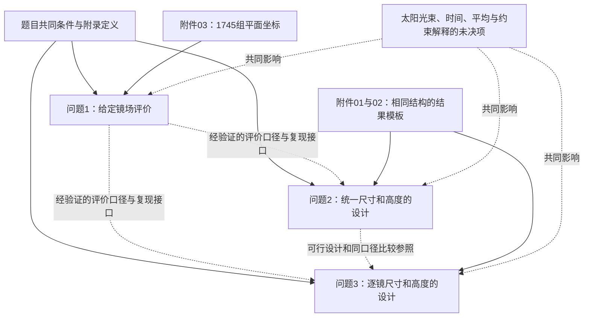

# S01 全题理解与逐问拆解

- 版本：v001；日期：2026-09-04（Asia/Shanghai）。
- 状态：本轮理解与拆解已完成，待用户验收；任何方法学习和求解均未开展。
- 输入版本：[S00材料审计](S00-材料审计-v001.md)及[原始材料清单](../诊断结果/原始材料清单-v001.json)固定的原件；无方法库正文。
- 本阶段目标：核清三问的对象、输入、输出、约束、评价要求、符号、依赖与未决事项，不形成最终模型或完整求解路线。
- 本阶段验收标准：逐问八项齐全；题面要求与建议验收分开；数值均有题面或附件出处；后续问题的输入接口和风险可追溯；无提前计算光学效率、输出功率或设计参数。

## 1. 证据标签与本轮边界

- **题目给定**：由PDF原页明确写出。
- **附件读取/诊断统计**：由本地工作簿直接读取或基础检查得到。
- **理解判断**：由题面与数据之间的对应关系作出的可审计解释，不冒充原句。
- **建议验收**：本轮建议后续增加的检查，不是题目原有评价指标。
- **待确认**：题面未明确或资料不足，本轮不作事实性补齐。
- **暂定假设**：本轮未采用影响光学结果或设计的计算假设；需要假设的位置均留在待确认清单。
- **待验证猜测**：本轮不提出最优布局、关键效率主导项或创新效果等猜测。

本文件中的公式仅用于原条件、基本定义和符号表述；题面附录公式的忠实整理见[公式与表格核对](../诊断结果/题面公式与表格核对-v001.md)。没有计算第1问结果，没有设置优化目标函数的具体实现或选择算法。

## 2. 全题重述

### 2.1 研究对象与现实问题

【题目给定】研究对象是塔式太阳能光热电站的定日镜场。各面定日镜根据太阳位置改变朝向，使来自太阳中心、经过镜面中心的光线反射后指向集热器中心。实际光束具有一定锥形角，因此镜面反射的能量不一定全部落到集热器上。

【理解判断】本题先评价一套给定镜场的集光表现，再在指定场地内设计两类镜场：一类要求所有镜面的尺寸、安装高度相同，另一类允许逐镜不同。两类设计都要达到规定的年平均输出热功率，并提高每单位镜面面积所产生的年平均热功率。

### 2.2 总目标及最终交付物

【题目给定】共3问，PDF第2页逐一明确编号为问题1、2、3。

| 问题 | 性质（理解判断） | 全题最终要求的交付物（题目给定，本轮不制作数值结果） |
|---|---|---|
| 1 | 给定布局下的光学性能与热功率评价 | 表1的逐月统计、表2的年平均统计 |
| 2 | 尺寸和安装高度统一条件下的镜场设计 | 表1、表2、表3；`result2.xlsx`逐镜设计清单 |
| 3 | 允许逐镜改变尺寸和安装高度的镜场设计 | 表1、表2、表3；`result3.xlsx`逐镜设计清单；表3的统一尺寸、统一安装高度栏可空缺 |

【理解判断】额定值及输出指标针对热功率。题目没有给热电转换效率，也没有要求计算电功率、全年实际发电量、投资回收期或电网调度；不能把这些增补成当前研究目标。表格要求的平均值基于题目指定的离散时点，不能称为实测全年连续运行平均。

### 2.3 共同研究边界和明确条件

以下来自PDF第1页，功率要求来自第2页，公式单位来自第3—4页。

| 项目 | 题目给定 | 对理解的意义或尚未明确处 |
|---|---|---|
| 场地位置 | 东经\(98.5^\circ\)、北纬\(39.4^\circ\)、海拔\(3000\,\mathrm{m}\) | 经纬度和海拔不是附件平面坐标；辐照度公式海拔单位为千米 |
| 建设区域 | 半径\(350\,\mathrm{m}\)的圆形区域 | 圆心是固定的坐标原点；设计塔位不等于允许移动场地 |
| 坐标方向 | 东为\(x\)正向，北为\(y\)正向，竖直向上为\(z\)正向 | 与太阳角度、镜面坐标、塔位及输出模板保持一致 |
| 吸收塔高度 | \(80\,\mathrm{m}\) | 特指集热器中心离地高度，不是集热器底面或顶面高度 |
| 集热器 | 高\(8\,\mathrm{m}\)、直径\(7\,\mathrm{m}\)，圆柱形外表受光式 | 不能擅自替换成平面靶或把直径当半径 |
| 禁布范围 | 吸收塔周围\(100\,\mathrm{m}\)内不安装定日镜 | 第1问塔位在原点；后两问应明确随塔位置解释此范围 |
| 镜面形状 | 平面矩形；上下两条边始终平行地面 | 宽、高是镜面尺寸，安装高度是中心离地高度 |
| 镜面边长 | 在\(2\,\mathrm{m}\)至\(8\,\mathrm{m}\)之间 | 题面另写“通常镜面宽度不小于镜面高度”；是否作硬约束需说明 |
| 安装高度 | 在\(2\,\mathrm{m}\)至\(6\,\mathrm{m}\)之间 | 还须保证绕水平转轴旋转时不触地；允许旋转范围未量化 |
| 镜间距离 | 相邻底座中心距离比镜面宽度多\(5\,\mathrm{m}\)以上 | “以上”的边界及异尺寸时取哪面镜宽需要明确 |
| 计算时点 | 每月21日当地时间9:00、10:30、12:00、13:30、15:00 | 共12个月、每月5个时点，即60个指定时点；时间权重未另写 |
| 光学与功率关系 | 附录给定总热功率和五项效率乘积定义 | 不直接提供每面镜子在各时点的效率值 |

【题目给定】每面镜子的安装高度等于定日镜中心离地高度。第1问附件仅给平面坐标，统一的竖坐标由题面的安装高度补全，不属于附件缺失记录。

### 2.4 已给信息、需从附件提取的信息和未知量

| 来源/类别 | 具体内容 | 当前状态 |
|---|---|---|
| 题目给定 | 场地、塔高、集热器几何、镜尺寸和安装范围、采样时点、附录定义、三问交付格式 | 已阅读与原页核对 |
| 附件读取 | 1745组平面坐标、米制单位、原Excel行号 | 已读取；基础诊断完成 |
| 附件读取 | 两份相同8列模板，列顺序及6个预置序号 | 已读取；不是已完成设计 |
| 第1问待求 | 各时点/月份/年度所需光学量与热功率统计 | 未开展计算 |
| 第2问待求 | 塔位、统一宽高、统一安装高度、镜数、各镜位置及指标 | 未开展设计 |
| 第3问待求 | 塔位、各镜宽高与安装高度、镜数、各镜位置及指标 | 未开展设计 |
| 待确认 | 太阳锥角及角分布、时间与平均口径、设计约束细节、模板填法 | 风险清单登记；不自行补值 |

## 3. 逐问拆解

### 3.1 问题1：评价给定镜场

| 项目 | 题意拆解 |
|---|---|
| 1. 核心任务 | 在镜位、尺寸、安装高度和塔位已固定的条件下，评价该镜场的光学效率与输出热功率，并按规定时点汇总。没有优化镜位或改变镜数的任务。 |
| 2. 输入 | 题面的共同条件；塔在圆心；所有镜面\(6\,\mathrm{m}\times6\,\mathrm{m}\)，安装高度\(4\,\mathrm{m}\)；附件03的1745组坐标；附录的太阳位置、DNI、输出功率和效率定义。没有前问输入。 |
| 3. 输出 | 表1：每个月21日的平均光学效率、平均余弦效率、平均阴影遮挡效率、平均截断效率、单位镜面面积平均输出热功率，最后一项单位为\(\mathrm{kW/m^2}\)。表2：上述4种效率的年均值、年平均总输出热功率\(\mathrm{MW}\)、单位镜面面积年平均输出热功率\(\mathrm{kW/m^2}\)。效率为无量纲，若使用百分数需统一标明。 |
| 4. 约束 | 使用原给定布局和参数；采用规定的12个月、每月5个时点；遵循题面的坐标、集热器几何、光学与功率定义。不得为改善评价值而移动原坐标。第1问没有60 MW达标要求。 |
| 5. 题面评价要求 | 明确要求计算上述指标并按表1、表2填写；没有给目标答案、允许误差、运行时间上限或指定算法。 |
| 6. 建议验收标准 | 60个时点覆盖完整；坐标条数和单位一致；效率数值有物理范围与分母定义检查；按同一口径回算月表、年表；总功率与单位面积指标、总镜面面积相互一致；保留逐时数据和必要中间量以供后问复用评价规则。具体数值容差待方法与实现确定后另行规定。 |
| 7. 依赖关系 | 无前问依赖。可为问题2、3提供经验证的评价定义、几何约定、统计口径和复现接口；第1问的1745面与给定镜位不自动成为后两问的限制。 |
| 8. 待确认事项 | 太阳锥角/角分布、当地时间解释、春分日计数约定、方位角分支、效率与时间平均口径、阴影/遮挡/截断的能量归属；是否以及怎样考虑未给尺寸的塔身影响。 |

### 3.2 问题2：统一尺寸和安装高度的镜场设计

| 项目 | 题意拆解 |
|---|---|
| 1. 核心任务 | 在规定场地和共同几何条件下，设计塔位、镜面统一尺寸、统一安装高度、镜数与镜位，达到额定年平均输出热功率，并使单位镜面面积年平均输出热功率尽量大。 |
| 2. 输入 | 共同条件、表1—3格式、8列输出模板；额定年平均热功率\(60\,\mathrm{MW}\)。建议继承第1问经验证的评价口径及复现规范，但不能直接继承第1问某个效率数值作为新场固定值。没有题面要求沿用原1745个镜位。 |
| 3. 输出 | 吸收塔平面坐标（米）；统一的镜面宽、高（米）；统一安装高度（米）；镜数（面）；各镜中心坐标（米）；表1、表2、表3；逐镜设计文件`result2.xlsx`。表3另需镜数和总镜面面积\(\mathrm{m^2}\)。 |
| 4. 约束 | 场地、塔高、集热器保持题面条件；镜面边长与安装高度范围、禁布区、镜间距、转动不触地条件均需满足；所有镜的尺寸和安装高度相同；达到\(60\,\mathrm{MW}\)的是年平均输出热功率。镜数应为实际可列出的正整数。额定值是等式还是下限及容差留待确认。 |
| 5. 题面评价要求 | 在达到额定功率条件下，单位镜面面积年平均输出热功率“尽量大”；并提交表格与`result2.xlsx`。题面没有给最优性差距、特定算法、预算或镜数上限。 |
| 6. 建议验收标准 | 先按统一解释逐项检查设计可行性；由导出的全部镜位与尺寸独立重算汇总；确认镜数、总面积、功率、单位面积功率和表3一致；额定条件用事先声明的精度判定；比较方案时固定采样、光学和平均口径；报告结论适用范围，不将有限搜索结果无依据称为全局最优。 |
| 7. 依赖关系 | 训练流程上需先通过问题1验收；技术上复用评价规则与验证证据。问题2设计可作为问题3的可比参照。塔位改变会影响禁布范围和所有相对几何量，不能只改输出表中的塔坐标。 |
| 8. 待确认事项 | 60 MW判定方式、塔位的允许区域、禁布区及外场界是按中心还是完整镜面判定、“通常宽不小于高”的约束性质、间距边界与转动范围；共同光学缺口；模板塔坐标填写与扩展行规则。 |

### 3.3 问题3：允许逐镜改变尺寸和安装高度的镜场设计

| 项目 | 题意拆解 |
|---|---|
| 1. 核心任务 | 保持问题2的额定条件和共同场地约束，解除“所有镜面尺寸相同、安装高度相同”的限制，重新设计镜场各参数，提高单位镜面面积年平均输出热功率。允许不同不等于要求每面镜都互不相同。 |
| 2. 输入 | 与问题2相同的场地、塔高、集热器、采样、额定值与模板结构；经验证的共同评价口径；问题2可行设计及指标可作参照，但题面不要求保留其塔位、镜数或布局。 |
| 3. 输出 | 塔位；逐镜宽度、高度、安装高度与中心坐标；总镜数和总镜面面积；表1、表2、表3；`result3.xlsx`。表3中的“定日镜尺寸”“定日镜安装高度”两栏可空缺，但逐镜文件仍必须填明这些参数。 |
| 4. 约束 | 问题2共同条件继续适用；每面镜均须满足尺寸和安装范围、离地及几何要求。不同镜宽之间的间距参照不能未经说明套用单一统一镜宽。年平均热功率额定条件与问题2一致。 |
| 5. 题面评价要求 | 达到与问题2相同额定值时，单位镜面面积年平均输出热功率尽量大；按表和文件要求完整提交。题面没有要求固定提升百分比或一定优于某个既有答案。 |
| 6. 建议验收标准 | 逐镜字段完整、镜数与文件行数一致；按逐镜面积核对总面积和功率；效率汇总清楚说明镜数权重或面积权重；异尺寸相邻间距与不同高度的几何检查覆盖全部镜位；同一评价口径下对照问题2；将“所有镜均取统一参数”的情形用于检验两问接口兼容性。比较效果仍未开展。 |
| 7. 依赖关系 | 训练顺序上在问题2通过验收后开展；在相同约束解释下，统一尺寸/高度是允许逐镜变化的一种特殊情形。问题3应能表示问题2的可行设计，但后续实际找到的结果好坏不能仅凭自由度更多作保证。 |
| 8. 待确认事项 | 继承问题2未决事项；额外重点是异尺寸间距、不同面积的平均效率口径、各镜高度与模板竖坐标的对应，以及表3留空不能代替逐镜清单。 |

## 4. 结果表与输出字段核对

【题目给定】表1的每月行没有“当月总输出热功率”这一独立列，最后一列是单位镜面面积功率；表2才有年平均总热功率列。本轮不擅自改变题目规定的表头。后续如为验证保留更细的总功率记录，应作为支持性数据另存。

| 表/文件 | 内容 | 单位和结构 |
|---|---|---|
| 表1 | 12个月21日各一行；4个效率指标、1个单位面积热功率指标 | 效率无量纲；功率密度\(\mathrm{kW/m^2}\) |
| 表2 | 1行年度汇总；4个效率指标、总热功率、单位面积热功率 | 总热功率\(\mathrm{MW}\)，功率密度\(\mathrm{kW/m^2}\) |
| 表3 | 塔位、宽×高、安装高度、总面数、总面积 | 长度/坐标为米，面积为平方米；问题3有两栏可空 |
| 8列模板 | 塔横坐标、塔纵坐标、镜序号、宽、高、镜横坐标、镜纵坐标、镜竖坐标 | 序号为整数；其余为米；模板6行并非镜数上限 |

## 5. 初步符号表

以下仅整理理解所需符号。题面已有符号优先沿用；新记号只是消除“塔高、海拔、镜面高、安装高”的混淆，没有增加待优化的物理对象。

### 5.1 固定量与时间

| 符号 | 含义 | 单位 | 已知/待求及范围 | 来源 | 待确认 |
|---|---|---|---|---|---|
| \(O\) | 建设圆形区域中心、坐标原点 | 无 | 已知，固定 | PDF第1页 | 不随塔移位 |
| \(R\) | 建设区域半径 | \(\mathrm{m}\) | 已知，350 | PDF第1页 | 中心与完整镜面边界解释 |
| \(r_0\) | 塔周围禁布半径 | \(\mathrm{m}\) | 已知，100 | PDF第1页 | 边界与禁布对象的精确定义 |
| \(\varphi\) | 当地纬度，北纬为正 | 角度 | 已知，\(39.4^\circ\) | PDF第1、3页 | 计算时角度单位统一 |
| \(\lambda\) | 当地经度，东经 | 角度 | 已知，\(98.5^\circ\) | PDF第1页 | 是否用于时间换算，题面未明确 |
| \(H\) | DNI公式中的场地海拔 | \(\mathrm{km}\) | 已知，3（由3000米换算） | PDF第1、3页 | 不与塔高或镜高混用 |
| \(H_T\) | 集热器中心离地高度，即塔高 | \(\mathrm{m}\) | 已知，80 | PDF第1页 | 不是底面或顶面高度 |
| \(h_R,d_R\) | 集热器高度、直径 | \(\mathrm{m}\) | 已知，8、7 | PDF第1页 | 塔身几何未由此给出 |
| \(ST\) | 附录中的当地时间小时数 | \(\mathrm{h}\) | 9、10.5、12、13.5、15 | PDF第1、3页 | 太阳时/钟表时约定 |
| \(D\) | 以春分为第0天起算的天数 | \(\mathrm{d}\) | 对12个指定日期取值，未计算 | PDF第3页 | 春分基准、跨年/闰年约定 |
| \(\alpha_s,\gamma_s\) | 太阳高度角、方位角 | 角度 | 由题给关系待确定 | PDF第3页 | 方位角零方向、正方向与分支；题面未完整规定 |
| \(\omega,\delta\) | 太阳时角、赤纬角 | 角度 | 由题给关系待确定 | PDF第3页 | 与\(ST,D\)约定联动 |
| \(G_0\) | 太阳常数 | \(\mathrm{kW/m^2}\) | 已知，1.366 | PDF第3页 | 无需外查替换 |
| \(\mathrm{DNI}\) | 法向直接辐射辐照度 | \(\mathrm{kW/m^2}\) | 待按题给式计算，物理上非负 | PDF第3页 | 不等同于地面水平辐照度 |

### 5.2 镜场几何与待设计量

| 符号 | 含义 | 单位 | 已知/待求及范围 | 来源 | 待确认 |
|---|---|---|---|---|---|
| \((x_T,y_T)\) | 吸收塔平面位置 | \(\mathrm{m}\) | 第1问为\((0,0)\)；第2、3问待设计 | PDF第2页、模板A/B列 | 允许塔位区域需精确定义 |
| \(N\) | 定日镜总面数 | 面 | 第1问附件统计1745；第2、3问待求正整数 | 附件03、PDF第2—3页 | 未给固定镜数上限 |
| \(i\) | 定日镜索引 | 无 | \(1\le i\le N\) | 附录、模板 | 原始坐标用Excel行号追溯，不重排原件 |
| \((x_i,y_i,z_i)\) | 第\(i\)面定日镜中心坐标 | \(\mathrm{m}\) | 第1问平面坐标已给，\(z_i=4\)；后两问待设计 | 附件03、PDF第1—2页 | 全场地面基准与中心/底座的几何解释 |
| \(w_i,h_i\) | 第\(i\)面镜面宽度、高度 | \(\mathrm{m}\) | 第1问均为6；后两问边长范围均为\([2,8]\) | PDF第1—2页 | “通常”宽不小于高的约束性质 |
| \(z_i\) | 安装高度，与上行竖坐标为同一量 | \(\mathrm{m}\) | 第1问4；后两问\([2,6]\)且转动不触地 | PDF第1—2页 | 旋转角范围未给，不另造独立高度变量 |
| \(A_i\) | 第\(i\)面镜子采光面积 | \(\mathrm{m^2}\) | 矩形镜面由宽、高确定 | PDF第1、3页 | 不改用占地面积作分母 |
| \(A_{\mathrm{tot}}\) | 总镜面面积 | \(\mathrm{m^2}\) | 待按逐镜面积汇总，本轮未计算总值 | 表3、附录 | 异尺寸不能简单套统一面积 |
| \(d_{\mathrm{HR},i}\) | 镜面中心至集热器中心的距离 | \(\mathrm{m}\) | 几何确定；题给透射率公式适用\(d_{\mathrm{HR},i}\le1000\) | PDF第4页 | 使用三维距离，不是平面半径 |

### 5.3 效率与交付指标

| 符号 | 含义 | 单位 | 已知/待求及范围 | 来源 | 待确认 |
|---|---|---|---|---|---|
| \(\eta_i\) | 第\(i\)面镜子光学效率 | 无量纲 | 待求；物理效率应在\([0,1]\) | PDF第3页 | 不提前赋经验常数 |
| \(\eta_{\mathrm{sb}},\eta_{\mathrm{cos}}\) | 阴影遮挡效率、余弦效率 | 无量纲 | 待求；物理上\([0,1]\) | PDF第3—4页 | 损失对象、区域重叠与统计定义 |
| \(\eta_{\mathrm{at}}\) | 大气透射率 | 无量纲 | 题给距离经验式，尚未代入 | PDF第4页 | 距离单位、适用域 |
| \(\eta_{\mathrm{trunc}}\) | 集热器截断效率 | 无量纲 | 题给能量比定义，待求 | PDF第4页 | 锥角、角分布与损失归属 |
| \(\eta_{\mathrm{ref}}\) | 镜面反射率 | 无量纲 | 题面允许常数，例如0.92 | PDF第4页 | 示例可选值不是唯一强制值；采用值需后续登记 |
| \(E_{\mathrm{field}}\) | 镜场输出热功率 | \(\mathrm{kW}\) | 按题给式的输入单位得出；待求 | PDF第3页 | 年表以MW报告，不能误称能量或电功率 |
| \(\overline E_{\mathrm{field}}\) | 题设时点下的年平均总热功率 | \(\mathrm{MW}\) | 第1问待评价；第2、3问有60 MW额定条件 | PDF第2页、表2 | 平均权重、额定等式/下限及容差 |
| \(\overline q\) | 单位镜面面积年平均输出热功率 | \(\mathrm{kW/m^2}\) | 第1问待评价；第2、3问要求尽量大 | PDF第2页、表2 | 分母为总镜面面积；与功率统一单位 |

本轮不引入太阳锥角的数值符号、不设置随机变量或优化算法参数，避免把尚缺的物理输入误写成已知量。

## 6. 题间依赖与误差传递

图中虚线表示方法或比较依赖，不表示题面要求沿用前问的镜数、坐标或效率常数。图只表达题意关系，不授权并行研究或越过训练阶段。

| 接口 | 应向后传递的内容 | 不应直接继承的内容 | 误差或不确定性传播 |
|---|---|---|---|
| 共同题面至三问 | 坐标方向、太阳/光学定义、采样时点、固定几何和单位 | 未经确认的历法修正、锥角或工程经验常数 | 若共同口径错误，所有三问的评价都受影响 |
| 问题1至问题2 | 经过验证的评价规则、输入字段约定、逐时到月/年的汇总约定与验证证据 | 1745面、给定镜位、固定尺寸及既有布局的效率数值 | 几何或效率偏差将影响达标判断与方案排序 |
| 问题1/2至问题3 | 评价接口和可行性解释；问题2完整设计和可比指标 | 统一尺寸或统一高度的约束、塔位必须不变的假定 | 面积加权错误会使两问的单位面积表现不可比 |
| 任一后问反馈至前问 | 发现前问评价定义不适合异尺寸时，定位旧口径和受影响结果 | 不直接覆盖旧代码与数值记录 | 后续阶段标为待重新验证；按授权回滚并建立新版本 |

【研究独立性判断】问题1可以独立评价。问题2并不在数学输入上必须使用第1问的某个数值答案，但需要可靠且一致的评价体系。问题3可对全部允许参数重新设计，同一约束下能包含统一设计这一特殊情形。实际训练执行仍严格遵守先前问验收、再后问的顺序；本轮三问均未开始求解。

## 7. 重要风险、歧义与对应检查

| 编号 | 事实或理解风险 | 涉及问题 | 建议检查或后续准备 | 当前状态 |
|---|---|---|---|---|
| R01 | 方法库正文、索引、版本和审核状态均缺失 | 全部 | 请用户提供获准本地资料，或明确授权基于现有知识继续 | 下一阶段前的资料门槛 |
| R02 | 题面给出锥形光束性质，但未给锥角数值和角分布 | 全部，直接影响截断 | 在获准资料中查明物理输入、来源和边界；没有来源时登记外部依赖，不能无声置为平行光或填惯用常数 | 待提供/确认 |
| R03 | 当地时间、春分第0天与年度约定不足以唯一确定所有计算口径 | 全部 | 对照附录定义写明采用约定和12个日期；不因经度自行套时区或猜年份 | 待确认，未计算太阳位置 |
| R04 | 方位角只给余弦关系，单凭该式不能唯一分辨分支 | 全部 | 固定角度零方向、正方向，按东/北坐标检查上午、正午、下午的方向关系 | 待确认约定 |
| R05 | 海拔、塔高、镜面高和安装高易混淆；辐照度与功率单位不同 | 全部 | 输入量按符号表核单位；保持塔高为集热器中心高度；检查kW与MW转换 | 已定位风险，未求解 |
| R06 | “年均”采样明确而权重未明写，问题3面积不同 | 全部，尤其3 | 明确时间权重、镜间权重和汇总顺序；不得把各平均效率的乘积直接当平均光学效率而不验证 | 待确认口径 |
| R07 | 阴影与反射遮挡的区域可能重叠，截断效率分母已扣阴影遮挡损失能量 | 全部 | 按题给定义核对能量流向、分母及损失的重复计入；共同情形做一致性检查 | 只是验收准备，未建模 |
| R08 | 塔位可变但场地圆心固定；100米范围以谁为中心易误读 | 2、3 | 在同一镜场坐标系中分别标明场地边界和塔周围禁布范围，不随塔位平移附件或场地 | 待几何口径确认 |
| R09 | 题面写“通常”宽不小于高，镜间距比较宽度在异尺寸时不唯一；旋转范围未量化 | 2、3 | 对硬约束/习惯说明分别记录；确认不同镜宽的配对规则、严格或非严格边界、转动不触地解释 | 未锁定数学约束 |
| R10 | 中心点位于场地内是否足够、塔位区域和塔身遮挡几何未详写 | 2、3及光学评价 | 确认边界作用于中心还是完整镜面；若考虑塔身影响，需用户提供或允许假设塔身几何 | 部分为条件性外部依赖 |
| R11 | “达到60 MW”可能被误写为瞬时功率要求或被直接假定严格相等 | 2、3 | 先确认年平均额定条件是下限/目标等式及允许偏差，再作可行性判断 | 待确认 |
| R12 | 用统一镜面积、按镜数平均来处理异尺寸情形会改变指标意义 | 3及2/3比较 | 输出与验收逐镜面积，复核总面积及统计权重；统一参数情形能兼容问题2 | 建议验收，未执行 |
| R13 | 两个匿名模板相同；6个序号易误作限制；表3空栏易误作逐镜参数可省略 | 2、3 | 输出前确认模板行扩展、塔位填法；逐镜数据必须齐全；检查表与文件一致 | 当前理解无阻塞 |
| R14 | 示意照片、参考链接和原题中的日期可能被当成外部检索线索 | 全部 | 只以本地题面文字与附件为依据，照片不用于反推布局，链接不访问 | 本轮隔离已执行 |

**外部依赖登记**：目前只有太阳光束参数，以及在纳入塔身遮挡时所需的塔身几何，属于可能需要额外物理资料才能闭合的输入；方法库属于流程资料缺口。尚未断言必须采用任何特定外部参数或方法。若用户不能补充，是否允许基于现有知识提出有边界的假设，应由后续授权决定。

## 8. 下一阶段资料准备与停止条件

【研究任务类型判断】问题1涉及太阳几何、光学损失和时点统计评价；问题2涉及共同约束下的布局与参数设计；问题3进一步涉及异尺寸、异安装高度的设计与一致评价。这些是任务类别，不是算法选型。

| 下一阶段需阅读的资料类别 | 对应问题与目的 | 当前本地文件 |
|---|---|---|
| 坐标、空间几何与反射关系的建模规范 | 三问统一几何定义、输入方向与单位 | 待提供，无可链接正文 |
| 太阳位置与辐照度使用条件、物理参数来源规范 | 第1问评价及后续复用，核对附录口径 | 待提供；题面附录已读，但不等同方法库 |
| 阴影、遮挡、能量接收与效率统计的通用方法资料 | 第1问评价所需条件及验证规范 | 待提供，不预选具体实现 |
| 参数设计、约束处理与方案评价的一般规范 | 后续第2、3问区分可行性、目标与比较条件 | 待提供，尚未阅读或选型 |
| 数值验证、敏感性、误差和可复现记录规范 | 后续各问验证 | 待提供；具体检查将在获准阶段确定 |

不要求方法库必然收录所有主题，不为适应教程目录改变题意。若某类只提供链接或审核状态不明，仍不能当作已提供正文。

当前具备完成S00、S01并交付验收的条件。下一步仅建议：用户验收本轮，补齐方法资料或明确知识使用权限，并在方案构造前确定重要物理输入与口径。随后由用户单独指定下一阶段。本轮到此停止。
