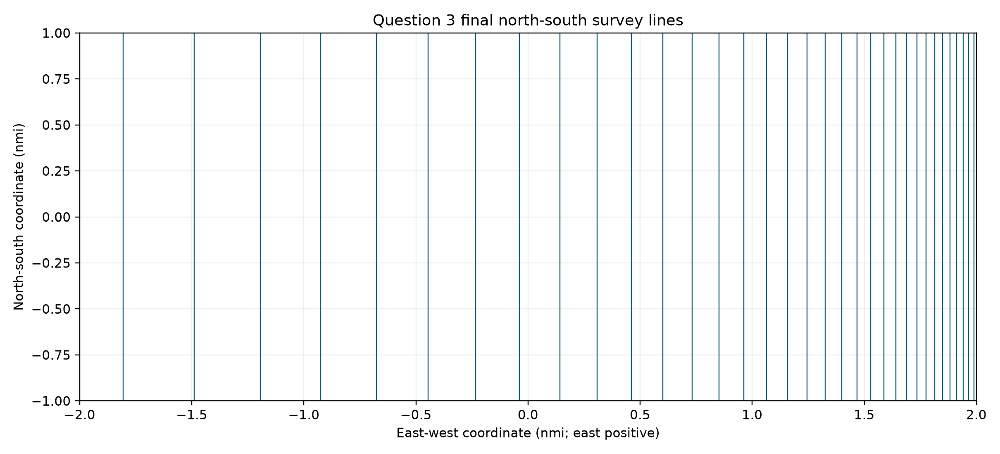
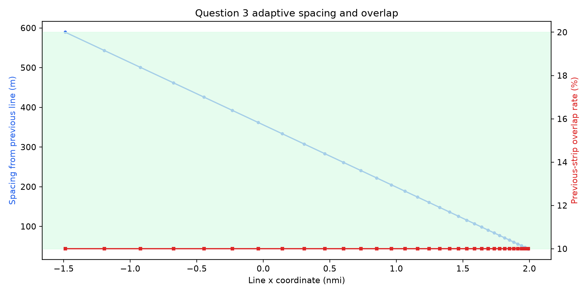

# 第 3 问：矩形斜坡海域的测线优化设计

## 问题分析

海域水深由西向东快速变浅，等深线为南北方向。固定间距不能同时满足深水侧和浅水侧的重叠约束；测线沿坡向时，同一条线又跨越很大的水深范围。本文在已批准的直线平行设计类中，以完整覆盖和 10%–20% 正式重叠率为硬约束，比较方向后选择南北向测线，并从深水侧向浅水侧按固定目标重叠率递推变间距。

## 方法与候选

### 1. 方法阅读

进入问题 3 前，完整读取 C01 与 C02，并回读 G00、G01、G02、V01 的公开接口。C01 的实际 SHA-256 为 24252039c8fbc6de01b2851c785e8e9b7739c30c984ecf2eb1e06b9a74c671b4；C02 为 a6706cc20dd06a8b7263a5552d9419b0895845f894ce8ddc85f8f7f7df7e32d5，均与 manifest v002 一致。没有读取 C03。

### 2. 已批准边界

- 主设计空间：矩形内的直线、平行线族；比较方向、偏移和变间距。
- 正式长度：每条测线与矩形的交段长度之和，不计转场、转弯和区域外延伸。
- 正式重叠率：有符号重叠除以前一条带宽度，使用未舍入数判断 10%–20%。
- 覆盖：必须以条带并集覆盖整个矩形，单独验证首尾边界。

### 3. 候选

1. 等深线方向的南北向变间距平行线：深度沿线恒定，能够按深水到浅水顺序递推。
2. 东西向坡向平行线：单条线穿过全部深度范围，按中心 15% 设置的 323.894 m 间距在西边产生 54.83% 重叠、在东边产生严重漏测，无法满足全程 10%–20%。
3. 等深线方向常间距：中心水深处的单一间距不能同时兼顾西侧深水和东侧浅水。
4. 近等深斜向：85°、88°、89° 的完整高度弦在浅水侧的宽度变化超出 10%–20% 允许窗口；89.2°、89.5°虽通过可通过必要筛查，但 34 条完整高度弦的放松长度分别为 125,948.28 m 与 125,940.80 m，仍高于 90° 的 125,936.00 m。

### 4. 选型

选择南北向等深线方向、从西向东变间距递推。它保持沿线水深恒定，允许相邻关系和重叠率在整个线段上一致，并在有限方向筛查中给出最短放松长度。最优性只限于声明的等深平行递推类和所做有限方向筛查，不扩展为任意曲线全局最优。

## 模型与设计

### 1. 坐标与设计变量

矩形东西宽 4 海里、南北长 2 海里，取中心为原点，x 向东上坡，y 向北。区域为 x∈[-3704,3704] m、y∈[-1852,1852] m。最终每条测线为 x=x_i、y∈[-1852,1852]。

### 2. 条带和递推

在坡面弧长坐标 q=x/cosα 中，水深为 D_i=D_0-x_i tanα。令

A=sinγ/cos(γ+α)，B=sinγ/cos(γ-α)，

则第 i 条带为 [q_i-A D_i, q_i+B D_i]，宽度为 (A+B)D_i。

首条线令左界恰达西边界。其后按西向东顺序取目标正式重叠率 η_0=0.1001，并令

L_i=R_{i-1}-η_0 W_{i-1}。

由于 L_i 对 x_i 为严格递增仿射函数，每一步有唯一解。末条线要求右界达到东边界。

### 3. 最终设计

- 方向：南向北，方向角 90°。
- 条数：34。
- 每条区域内长度：3704 m。
- 总长度：125,936 m，即 125.936 km。
- 第一条横坐标：-3345.4782 m；末条横坐标：3684.9455 m。
- 水深从 197.6044 m 递减至 13.5063 m。
- 相邻水平间距从 589.2744 m 递减至 43.6886 m。
- 首条覆盖左界为 -3704.0000 m；末条覆盖右界为 3707.3242 m。
- 逐线端点、深度、间距、宽度、重叠和两种分母结果见第3问测线设计-v001.xlsx 与同名 CSV。

### 4. 候选搜索

目标重叠率 10.00%、10.01%、10.10% 均得到 34 条；10.50%、15.00%、20.00% 分别需 35、36、39 条。为避免浮点数恰处在下界，正式方案采用 10.01%，同时保持最低条数。

## 最终逐线方案

每条线从南边界 (y=-1852) m 延伸到北边界 (y=1852) m；表中 (x) 以海域中心为原点、向东为正。

|编号|x/海里|水深/m|前线间距/m|正式重叠率/%|长度/m|
|---:|---:|---:|---:|---:|---:|
|L01|-1.8064|197.6044|—|—|3704|
|L02|-1.4882|182.1737|589.2744|10.0100|3704|
|L03|-1.1949|167.9480|543.2587|10.0100|3704|
|L04|-0.9245|154.8331|500.8363|10.0100|3704|
|L05|-0.6752|142.7424|461.7266|10.0100|3704|
|L06|-0.4453|131.5958|425.6709|10.0100|3704|
|L07|-0.2334|121.3197|392.4308|10.0100|3704|
|L08|-0.0381|111.8460|361.7863|10.0100|3704|
|L09|0.1420|103.1120|333.5348|10.0100|3704|
|L10|0.3081|95.0601|307.4895|10.0100|3704|
|L11|0.4611|87.6370|283.4780|10.0100|3704|
|L12|0.6022|80.7935|261.3416|10.0100|3704|
|L13|0.7323|74.4845|240.9337|10.0100|3704|
|L14|0.8523|68.6681|222.1195|10.0100|3704|
|L15|0.9628|63.3059|204.7744|10.0100|3704|
|L16|1.0648|58.3624|188.7838|10.0100|3704|
|L17|1.1587|53.8049|174.0419|10.0100|3704|
|L18|1.2454|49.6034|160.4512|10.0100|3704|
|L19|1.3253|45.7299|147.9218|10.0100|3704|
|L20|1.3989|42.1589|136.3707|10.0100|3704|
|L21|1.4668|38.8668|125.7217|10.0100|3704|
|L22|1.5294|35.8317|115.9042|10.0100|3704|
|L23|1.5871|33.0337|106.8534|10.0100|3704|
|L24|1.6402|30.4541|98.5094|10.0100|3704|
|L25|1.6893|28.0760|90.8169|10.0100|3704|
|L26|1.7345|25.8836|83.7251|10.0100|3704|
|L27|1.7762|23.8623|77.1871|10.0100|3704|
|L28|1.8146|21.9990|71.1597|10.0100|3704|
|L29|1.8500|20.2811|65.6029|10.0100|3704|
|L30|1.8827|18.6974|60.4800|10.0100|3704|
|L31|1.9128|17.2373|55.7572|10.0100|3704|
|L32|1.9405|15.8913|51.4032|10.0100|3704|
|L33|1.9661|14.6503|47.3892|10.0100|3704|
|L34|1.9897|13.5063|43.6886|10.0100|3704|

## 验证、稳定性与结论强度

### 1. 独立几何验证

独立程序不调用解析分宽，而把两条二维边界射线逐条与海底直线求交，再把水平端点组成覆盖区间。34 条线的最大端点差为 4.55×10^-13 m。

### 2. 可行性

| 检查 | 结果 |
|---|---|
| 全矩形覆盖 | 通过；横向并集长度 7408 m |
| 漏测面积 | 0 m² |
| 西、东边界 | 分别由首、末条带覆盖 |
| 最大横向空隙 | 0 m |
| 正式重叠率 | 10.0100%–10.0100% |
| 负重叠或间隙 | 无 |
| 当前宽度分母敏感性 | 10.8579%–10.8579%，仍可行 |
| 逐线长度重求和 | 125,936 m |
| 深度、方向、单位与有限性 | 通过 |
| 邻近目标扰动 | 10.00%、10.01%、10.10% 均为 34 条 |

### 3. 长度比较与结论强度

15% 解析基线需 36 条、133,344 m；正式方案减少 7,408 m，约 5.56%。在等深平行递推类中，首条线取最东可行位置、每一步取最大允许间距，34 条为最小条数；有限近等深方向筛查也未得到更短放松值。没有证明更一般非平行线、折线或曲线中的全局最优。

## 模型局限

1. 最优性限于南北向等深平行递推类及有限近方向筛查；未证明任意非平行直线或曲线方案的全局最优。
2. 区域外为了实际进入测线所需的延伸、转场和转弯未计入正式长度。
3. 海底按恒定坡面处理，重叠率沿每条南北向线保持一致；复杂地形需在问题 4 中改用局部地形模型。
4. 实际工程还需考虑安全水深、船舶机动和设备误差，本问未引入题面外参数。

## 本问小结

最终方案由 34 条南北向变间距测线组成，区域内总长度为 125.936 km。未舍入正式重叠率为 10.01%，备选当前宽度分母为 10.8579%，全矩形覆盖并集的漏测面积为 0。端点独立求交、边界、区间并集、逐线求和和目标扰动检查均通过。

