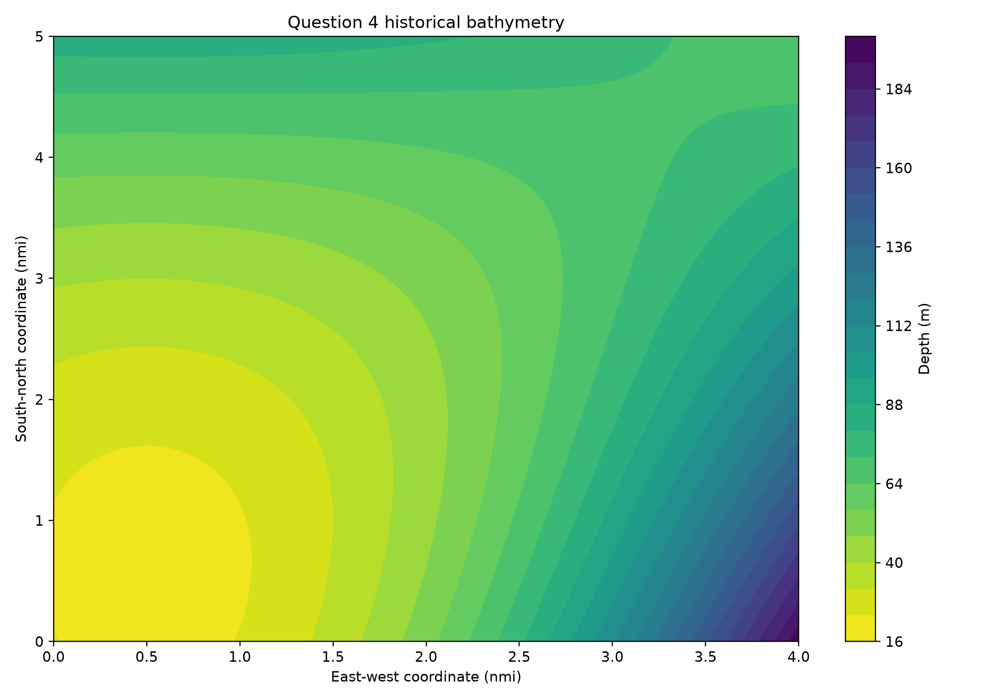
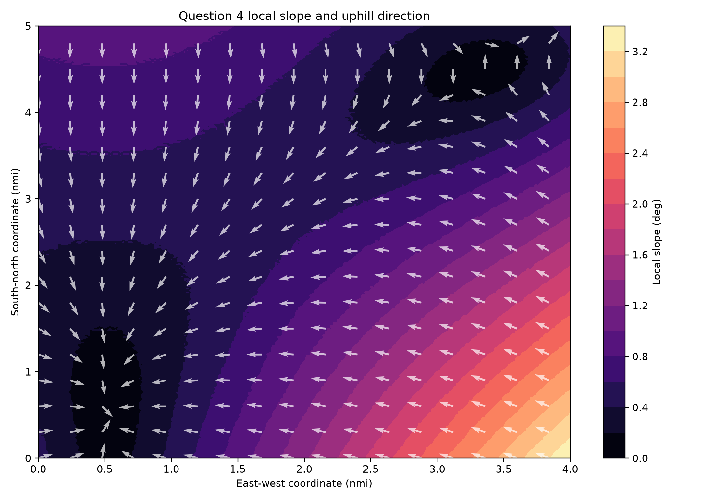
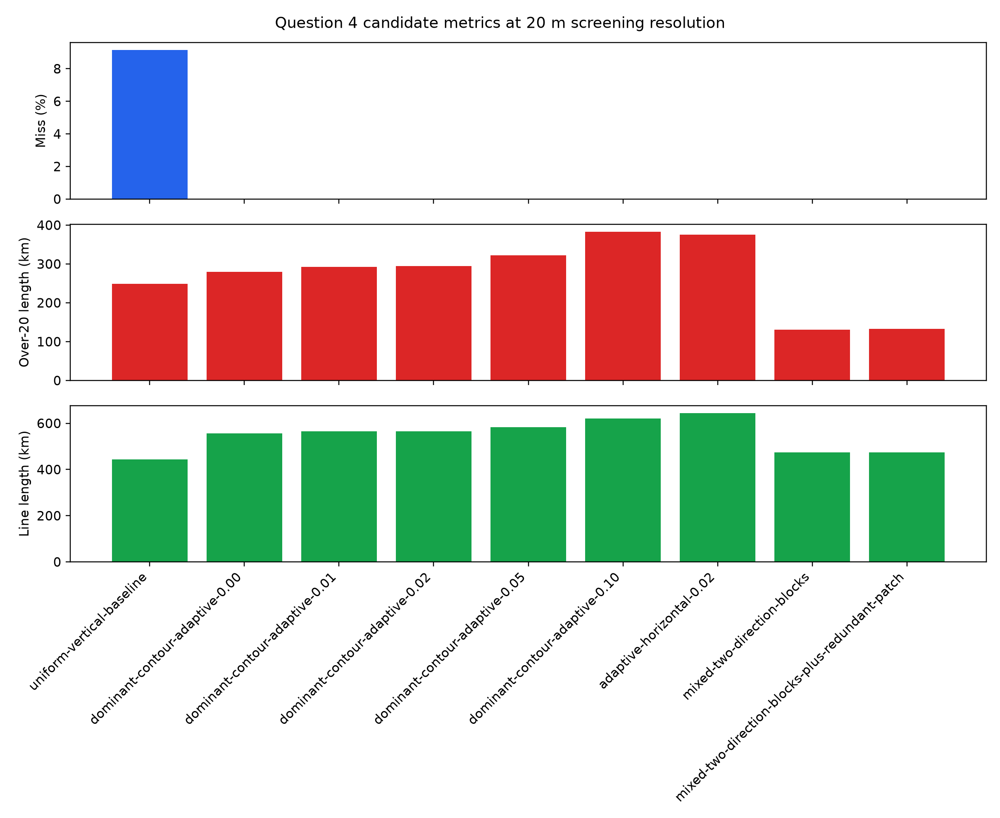
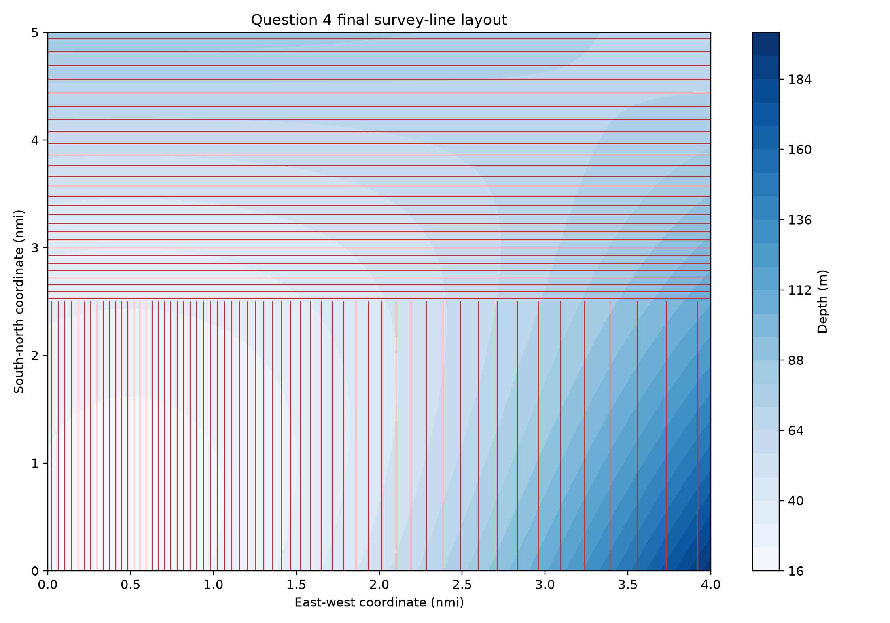
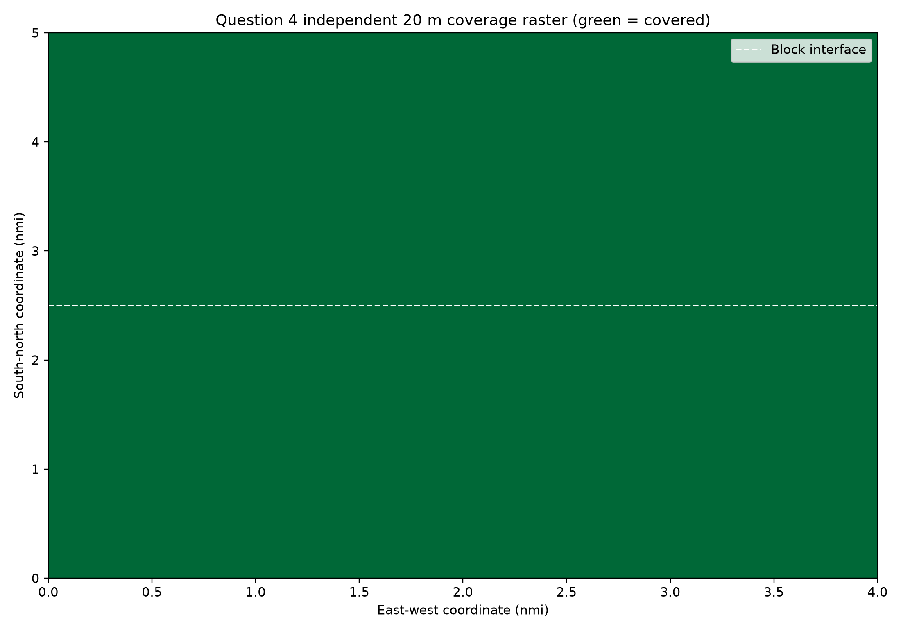
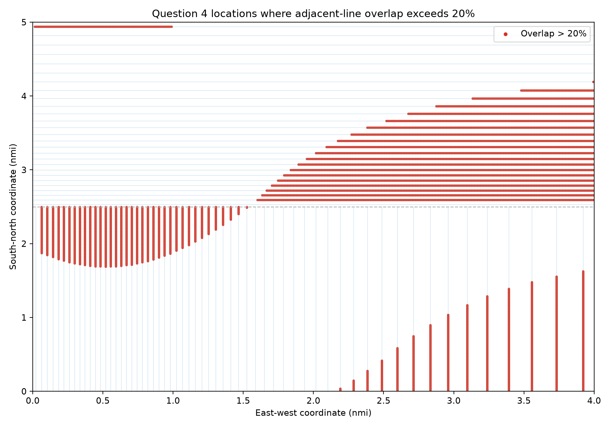

# 第4问：基于历史水深网格的分块测线规划

## 1 问题分析

本问需要根据历史水深网格设计一组可复现的测线，并同时评价漏测面积比例、相邻重叠率超过 \(20\%\) 的相关测线段总长度以及区域内测线总长度。三项指标存在竞争关系：缩小间距有利于覆盖，却增加测线长度与过度重叠；增大间距则可能产生漏测。因此本文采用可行性优先的分层目标：首先使漏测面积率尽可能小；在达到冻结覆盖容差的方案中，进一步减小过度重叠线段长度；最后比较测线总长度。

## 2 数据与规划假设

附件给出东西向 \(0\sim4\) 海里、南北向 \(0\sim5\) 海里的规则网格，步长均为 \(0.02\) 海里，水深矩阵为 \(251\times201\)。坐标在几何接口处按 \(1\) 海里 \(=1852\) m 转为米。数据水深范围为 20.0—197.2 m，不含空值和非正值。

第4问未单独重复设备开角。本文采用用户批准的规划基准：总开角 \(\theta=120^\circ\)，半开角 \(\gamma=60^\circ\)。同时将附件历史水深作为当前规划地形。两者均属于规划假设：若实际设备开角不同，或海底相较历史数据发生变化，覆盖、重叠和长度均需重新计算。

## 3 地形表示

主模型采用规则网格单元内的分片双线性水深面。设单元归一坐标为 \((u,v)\)，四角水深为 \(D_{00},D_{10},D_{01},D_{11}\)，则

\[
D(u,v)=(1-u)(1-v)D_{00}+u(1-v)D_{10}+(1-u)vD_{01}+uvD_{11}.
\]

由解析偏导获得 \(D_x,D_y\)。取水面为 \(z=0\)、海底高程为 \(z=-D\)，局部上坡梯度为 \((-D_x,-D_y)\)，坡度为

\[
\alpha=\arctan\sqrt{D_x^2+D_y^2}.
\]

该模型在全部原始网格节点的最大重建误差为 \(5.684\times10^{-14}\) m。网格坡度中位数为 \(0.6189^\circ\)，95% 分位数为 \(2.2200^\circ\)，最大值为 \(3.3719^\circ\)。总体上坡方向近西向，但局部坡向随位置明显变化，因此仅依据单一平均坡向布线会造成局部冗余或漏测。

## 4 局部覆盖边界

在水平规划域中，用 \(s\) 表示测线沿线坐标，用 \(c\) 表示其横向中心坐标。测线横向单位方向与局部高程梯度的点积给出有向横向坡度 \(m_\perp\)。两侧边界射线与局部切平面相交后，水平投影的左右覆盖距离为

\[
w_L=\frac{D\sin\gamma}{\cos\gamma-m_\perp\sin\gamma},\qquad
w_R=\frac{D\sin\gamma}{\cos\gamma+m_\perp\sin\gamma}.
\]

于是局部覆盖区间为

\[
I(s)=[c-w_L(s),\;c+w_R(s)].
\]

由于待测区域的边长是在水平面内给出的，本问以条带水平投影的并集计算覆盖面积。若将水平宽度乘以 \(\sqrt{1+m_\perp^2}\)，可恢复第2问的坡面覆盖宽度，因而两个模型在单一平面地形下相容。

## 5 目标函数与计数口径

沿每个分区的测线有效段离散取样，将所有局部条带区间合并，积分未覆盖宽度得到漏测面积 \(A_{\mathrm{miss}}\)，并计算

\[
p_{\mathrm{miss}}=\frac{A_{\mathrm{miss}}}{A_{\mathrm{total}}}\times100\%.
\]

同一分区内按横向中心坐标递增确定相邻测线。对有序相邻对 \((i-1,i)\)，定义

\[
\eta_i(s)=\frac{R_{i-1}(s)-L_i(s)}{R_{i-1}(s)-L_{i-1}(s)}.
\]

统计 \(\eta_i(s)>20\%\) 的沿线长度并对有序相邻对求和。同一物理线段若与左右两侧分别超限，可以分别计入两个相邻对。不同分区之间不人为构造相邻对，所有覆盖和统计均裁剪至各自分区。

正式总长度仅包括各测线在待测矩形内部的有效线段，不计转场、转弯、港口往返和区域外连接。

## 6 候选构造与方案选择

本文实际生成并计算了九个代表性候选，包括统一纵向等间距基线、五个目标重叠率的纵向自适应方案、横向自适应方案、南北分块两方向方案，以及在分块方案上增加局部修补线的方案。20 m 粗筛结果如下。

| 方案 | 漏测率/% | 过度重叠长度/km | 总长度/km |
|---|---:|---:|---:|
| 统一纵向等间距基线 | 9.138880 | 248.820 | 444.480 |
| 纵向自适应，目标0 | 0 | 279.820 | 555.600 |
| 纵向自适应，目标1% | 0 | 292.680 | 564.860 |
| 纵向自适应，目标2% | 0 | 294.320 | 564.860 |
| 纵向自适应，目标5% | 0 | 321.860 | 583.380 |
| 纵向自适应，目标10% | 0 | 383.360 | 620.420 |
| 横向自适应，目标2% | 0 | 375.312 | 644.496 |
| 南北分块两方向 | 0 | 131.312 | 473.186 |
| 分块方案加修补线 | 0 | 132.794 | 474.668 |

统一基线虽然最短，却存在约 9.14% 的漏测。其余零漏测候选中，南北分块方案的过度重叠长度最小，且增加修补线并未改善覆盖。因此按冻结的字典序准则选取南北分块两方向方案。

## 7 最终测线方案

以 \(y=2.5\) 海里，即 \(y=4630\) m 为分区接口：

- 南区布置 59 条南北向测线，均从南向北航行，每条区域内长度为 4630 m；中心东西坐标从 40.079656 m 递增至 7262.917906 m。
- 北区布置 27 条东西向测线，均从西向东航行，每条区域内长度为 7408 m；中心南北坐标从 4686.811266 m 递增至 9148.054595 m。

接口采用半开归属：南区负责 \(0\le y<4630\) m，北区负责 \(4630\le y\le9260\) m。全方案共 86 条测线，总长度为

\[
L_{\mathrm{total}}=59\times4630+27\times7408=473186\text{ m}=473.186\text{ km}.
\]

完整端点和逐线属性见机器可读结果工作簿。

## 8 覆盖、重叠与稳定性验证

冻结方案后，采用独立实现的局部射线—平面公式和二维栅格并集重新验证，未调用候选生成器。双线性地形下 10 m 与 5 m 栅格均无漏测单元；5 m 主模型的正式指标为

\[
p_{\mathrm{miss}}=0\%,\qquad
L_{\eta>20\%}=131287.199730\text{ m}\approx131.287\text{ km}.
\]

分辨率和地形表示结果为：

| 表示与步长 | 漏测面积/m² | 漏测率/% | 过度重叠长度/km |
|---|---:|---:|---:|
| 双线性 10 m | 0 | 0 | 131.292194 |
| 双线性 5 m | 0 | 0 | 131.287200 |
| 主对角三角面 5 m | 0 | 0 | 131.272201 |
| 副对角三角面 5 m | 0.006571 | \(9.5783\times10^{-9}\) | 131.277205 |

双线性 10 m 与 5 m 的过度重叠长度相差约 4.995 m，三种 5 m 地形表示的结果位于 131.272—131.287 km。副对角三角面下极小的漏测面积源于表示与边界离散差异，仍支持“规划分辨率下近零漏测”的结论。人工平坦地形、随机单一平面、与第2问坡面公式退化、节点重建、边界裁剪、相邻关系、总长度重算和输出文件读回均通过。

## 9 模型局限

本方案依赖历史地形和用户批准的设备开角，不含真实海底时变、船舶定位与姿态误差、声速剖面、设备标定误差、转弯半径和转场成本。数值细化差异不是物理误差置信区间。选型结论仅适用于本文实际计算的有限直线和有限分块候选，不能外推为任意曲线测线的全局最优。

## 10 小结

本文以双线性历史地形和局部射线—切平面模型构造覆盖条带，并以可行性优先的三层目标筛选测线。最终 86 条分块直线的区域内总长度为 473.186 km；5 m 双线性评价下漏测率为 0，过度重叠相关线段逐对计数总长为 131.287 km。独立栅格、人工地形、分辨率和三角剖分敏感性均支持该结论。

