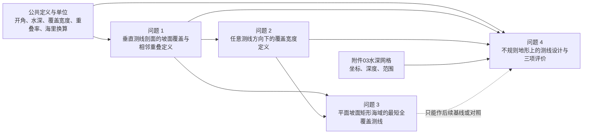

# S01 题目理解 v001

## 1. 阶段信息

- 盲题编号：B-M9R2
- 阶段：全题理解与逐问拆解
- 版本：v001
- 日期：2026-09-07
- 当前状态：已保存，待用户验收
- 依据：`题目.pdf` 全部 3 个物理页面、三个附件全部工作表，以及 `S00-材料审计-v001.md`
- 阶段边界：忠实整理问题定义、输入、输出、约束、符号、依赖和未决事项；不构造完整候选方案，不选择算法，不推导正式模型，不计算题目答案。

## 2. 全题结构

全题共有 **4 个编号问题**，没有另行编号的小问。

- 问题 1、问题 2 各包含“建立数学模型”和“按给定条件填写指定结果表”两个连续任务，但题面没有把它们编号为独立小问。
- 问题 3 是一个带覆盖与重叠约束的测线设计任务。
- 问题 4 给出 3 项设计要求和 3 项结果指标；这些是同一个问题中的要求与交付指标，不是另外编号的小问。

全题研究对象是多波束测深条带与测线布设。共同核心量包括水深、换能器开角、海底坡度或局部地形、测线方向、覆盖宽度、相邻条带重叠率、测线总长度以及漏测情况。

## 3. 题面共同定义与公共条件

### 3.1 题面直接给出的共同定义

- 多波束系统在与航迹垂直的平面内发射多个波束，形成以测线为轴线的覆盖条带。
- 覆盖宽度随换能器开角和水深变化。
- 在测线平行且海底平坦的情形，题面把相邻条带重叠率定义为 $η = 1 - d/W$，其中 $d$ 是相邻测线间距，$W$ 是条带覆盖宽度；当 $η < 0$ 时表示漏测。
- 一般质量要求是相邻条带具有 10%–20% 的重叠率。问题 3 明确把该区间作为约束；问题 4 改为“尽量控制在 20% 以下”，不等价于问题 3 的双侧硬约束。
- 坐标使用海里时，题面给出 $1$ 海里等于 $1852$ 米。

### 3.2 不能静默跨问题复用的条件

- 问题 1 至问题 3 分别明确给出换能器开角 $120°$，问题 4 没有明确给出开角，因此不能自动把 $120°$ 写成问题 4 的题面事实。
- 问题 1 至问题 3 给出平面坡度 $1.5°$；问题 4 使用附件水深网格描述不规则地形，不能把固定坡度 $1.5°$ 传入问题 4。
- 问题 3 的 10%–20% 重叠率是明确约束；问题 4 只有尽量不超过 20% 的要求，不能把 10% 下限强加给问题 4。

## 4. 逐问重述与任务接口

### 4.1 问题 1

**忠实重述：** 在垂直于测线方向的剖面内，把海底视为与水平面成坡度 $α$ 的斜线。需要描述多波束条带覆盖宽度以及相邻条带重叠率与水深、开角、坡度、测线位置和测线间距之间的关系。随后在题面给定的开角、坡度和中心水深条件下，对表 1 的 9 个位置报告水深、覆盖宽度及相对前一条测线的重叠率，并按规定文件名保存结果。

| 项目 | 内容 |
|---|---|
| 问题编号 | 问题 1 |
| 任务类型 | 几何关系建模、指标计算、表格交付 |
| 已知输入 | 坡面剖面与水平面的夹角；换能器开角 $120°$；坡度 $1.5°$；海域中心点水深 70 m；测线相对中心的 9 个位置 $-800, -600, …, 800$ m；题面给出的平坦海底重叠率定义；`附件01.xlsx` 模板 |
| 决策变量或待求量 | 各位置水深、各位置覆盖宽度、除首条外各条测线相对前一条的重叠率；一般情形下覆盖宽度和重叠率的数学表达关系 |
| 约束条件 | 剖面海底为题面定义的直线坡面；换能器中心线与图示垂向关系一致；结果位置和单位必须与表 1 对齐；不得把首条测线写成与不存在的前一条线重叠 |
| 目标或评价指标 | 本问不是优化任务；目标是给出题意一致、量纲正确的覆盖宽度与相邻条带重叠率模型，并完成指定位置的指标 |
| 必需输出 | 正文中的表 1 格式结果；后续生成 `result1.xlsx`；模型定义和必要说明 |
| 与其他问题的依赖 | 为问题 2 的任意方向覆盖关系提供剖面基础；为问题 3 的覆盖和相邻重叠约束提供基础定义；问题 4 也会复用覆盖/重叠概念，但不能直接复用固定坡面参数 |
| 当前未决事项 | 表 1 正负位置与上坡/下坡方向的对应；坡面上左右覆盖不对称时“覆盖宽度”和相邻重叠率的精确定义与归一化分母 |
| 本阶段禁止提前决定的事项 | 解析表达形式、符号方向最终约定、舍入精度、误差阈值、实现方式和任何数值结果 |

### 4.2 问题 2

**忠实重述：** 在矩形待测海域中，测线方向可以与海底坡面法向的水平投影形成方向夹角 $β$。需要描述该方向关系下多波束覆盖宽度随坡度、开角、水深、测线方向和位置变化的数学关系。随后对 8 个方向角和从中心出发的 8 个距离组合报告覆盖宽度，并按规定表格与文件名交付。

| 项目 | 内容 |
|---|---|
| 问题编号 | 问题 2 |
| 任务类型 | 三维方向几何建模、指标计算、矩阵表交付 |
| 已知输入 | 测线方向与坡面法向水平投影的夹角定义；换能器开角 $120°$；坡度 $1.5°$；海域中心水深 120 m；方向角 $0°, 45°, …, 315°$；距中心 $0, 0.3, …, 2.1$ 海里；`附件02.xlsx` 模板 |
| 决策变量或待求量 | 任意方向和位置的覆盖宽度；表 2 中 64 个覆盖宽度值 |
| 约束条件 | 海底按题面图 8 的平面坡面理解；距离和方向必须与表 2 的行列一一对应；单位换算必须一致；角度超过 $180°$ 时应按有向方向而不是仅取无向锐角处理 |
| 目标或评价指标 | 本问不是优化任务；目标是建立方向变化下的覆盖宽度关系并完成表 2 |
| 必需输出 | 正文中的表 2 格式结果；后续生成 `result2.xlsx`；模型定义和必要说明 |
| 与其他问题的依赖 | 依赖问题 1 中覆盖宽度的基本几何定义，但需要扩展到任意测线方向；可为问题 3 的测线方向比较提供公共几何接口；问题 4 只能复用定义和验证思想，不能直接套用平面坡面 |
| 当前未决事项 | $β$ 的有向起始轴和顺/逆时针约定；表中正距离是沿所列方向从中心前进的距离这一解释需明确写出；坡面水平法向投影指向上坡还是下坡的符号约定 |
| 本阶段禁止提前决定的事项 | 坐标变换具体形式、解析推导、对称性利用方式、舍入精度、误差阈值和任何数值结果 |

### 4.3 问题 3

**忠实重述：** 在南北 2 海里、东西 4 海里的矩形海域内，已知中心水深、东西向深浅趋势、坡度和开角。需要给出一组能够完整覆盖整个区域的具体测线，使相邻条带的重叠率保持在 10%–20%，并在满足这些条件的测线组中使测线总长度最短。

| 项目 | 内容 |
|---|---|
| 问题编号 | 问题 3 |
| 任务类型 | 测线设计、约束优化、覆盖验证 |
| 已知输入 | 矩形海域南北长 2 海里、东西宽 4 海里；中心水深 110 m；西深东浅；坡度 $1.5°$；换能器开角 $120°$；相邻条带重叠率要求 10%–20% |
| 决策变量或待求量 | 测线数量、每条测线的位置、方向、端点/范围及其组合；测线总长度 |
| 约束条件 | 整个矩形待测海域必须被覆盖；相邻条带重叠率必须满足 10%–20%；题面给定几何和单位必须保持一致 |
| 目标或评价指标 | 在覆盖与重叠约束满足的前提下，使测线总长度最短 |
| 必需输出 | 一组具体可复现的测线；总长度或能够支持“最短”结论的目标值；覆盖完整性和相邻重叠率约束的核验说明。题面未指定单独结果文件或固定表格 |
| 与其他问题的依赖 | 需要问题 1 的覆盖/重叠定义和问题 2 的方向几何接口；不依赖问题 1、2 的表格数值本身 |
| 当前未决事项 | 测线是否必须为直线且相互平行；是否允许曲线或分段线；测线能否延伸到海域外；总长度是否包含区域外延伸、转弯和测线间航渡；变深条带的局部重叠率如何定义 |
| 本阶段禁止提前决定的事项 | 优化方法、搜索空间离散、最优性证明形式、覆盖判定精度、收敛阈值、随机种子和计算预算 |

### 4.4 问题 4

**忠实重述：** 给定一个东西 4 海里、南北 5 海里的历史单波束水深网格，需要利用该网格为多波束测量船设计具体测线。设计应尽量覆盖整个区域、尽量把相邻条带重叠率控制在 20% 以下，同时尽量缩短总测线长度。完成设计后，需要报告测线总长度、漏测面积比例，以及重叠率超过 20% 的相关线段总长度。

| 项目 | 内容 |
|---|---|
| 问题编号 | 问题 4 |
| 任务类型 | 数据驱动地形表示、测线设计、多目标优化、空间覆盖与重叠评价 |
| 已知输入 | `附件03.xlsx` 的 $201 × 251$ 完整水深网格；横向坐标 0–4 海里且由西向东；纵向坐标 0–5 海里且由南向北；坐标步长 0.02 海里；水深单位为米；三项题面设计要求 |
| 决策变量或待求量 | 具体测线的数量、几何形状、位置、方向、端点/范围和组合；三个规定评价指标 |
| 约束条件 | 条带尽可能覆盖区域；相邻条带重叠率尽量控制在 20% 以下；总长度尽可能短；应使用附件水深数据；坐标与单位换算保持一致 |
| 目标或评价指标 | 题面给出三个并列目标倾向，但没有规定权重、优先级或字典序；交付指标为总长度、漏测面积百分比、重叠率超过 20% 部分的总长度 |
| 必需输出 | 一组具体可复现的测线；测线总长度；漏测面积占总面积的百分比；重叠率超过 20% 部分的总长度。题面未指定固定表格或结果文件名 |
| 与其他问题的依赖 | 复用问题 1、2 的覆盖宽度、方向和重叠定义接口；不应把问题 3 的平面坡面最优测线直接当作本问结论。问题 3 的结果至多可作为后续基线或对照 |
| 当前未决事项 | 本问换能器开角未给；三个目标之间的取舍规则未给；历史水深能否直接代表当前规划地形；测线允许的几何类别和长度口径未给；“重叠率超过 20% 部分的总长度”的空间统计口径需明确 |
| 本阶段禁止提前决定的事项 | 地形插值/曲面表示、条带计算方式、优化算法、离散分辨率、边界处理、收敛阈值、随机种子、计算预算、目标权重和任何正式结果 |

## 5. 初步符号表

| 符号 | 含义 | 单位 | 来源 | 当前状态 | 适用问题 |
|---|---|---|---|---|---|
| $θ$ | 多波束换能器总开角 | 度 | 题面图示及各问条件 | 问题 1–3 题面给定为 $120°$；问题 4 当前无法确认 | 1–4 |
| $α$ | 海底坡面与水平面的坡度角 | 度 | 问题 1 定义 | 问题 1–3 题面给定为 $1.5°$；问题 4 不采用统一常数 | 1–4 |
| $β$ | 测线方向与坡面法向水平投影的方向夹角 | 度 | 问题 2 定义 | 题面定义；有向角约定待明确 | 2–4 |
| $D$ | 换能器所在位置的垂向海水深度 | m | 题面和图示 | 中心水深在问题 1–3 给定；其他位置为待求量 | 1–3 |
| $D(x,y)$ | 水平坐标 $(x,y)$ 处的水深 | m | `附件03.xlsx` | 附件读取；网格节点已给，节点间表示尚未决定 | 4 |
| $W$ | 单条测线对应的海底覆盖宽度 | m | 题面定义 | 待建模、待计算；斜坡上的测量方向和定义需明确 | 1–4 |
| $d$ | 相邻两条测线的间距 | m 或海里 | 题面定义 | 问题 1 表中间距可由位置读取；设计问题中为待确定量 | 1、3、4 |
| $η$ | 相邻条带重叠率 | 无量纲，通常以 % 报告 | 题面定义 | 平坦海底定义已给；变深/不对称条带下定义待批准 | 1、3、4 |
| $s$ | 问题 1 中相对海域中心的有符号横向位置 | m | 表 1 的表示需求 | 表示约定；正方向待明确 | 1 |
| $r$ | 问题 2 中测量船距海域中心的距离 | 海里 | 表 2 | 题面给定离散值 | 2 |
| $x$ | 横向坐标，由西向东 | 海里 | `附件03.xlsx` 表头 | 附件读取，范围 0–4 | 4 |
| $y$ | 纵向坐标，由南向北 | 海里 | `附件03.xlsx` 表头 | 附件读取，范围 0–5 | 4 |
| $Ω_3$ | 问题 3 的矩形待测海域 | 海里²或 m² | 问题 3 | 表示约定，尺寸题面给定 | 3 |
| $Ω_4$ | 问题 4 的矩形待测海域 | 海里²或 m² | 问题 4 和附件 | 表示约定，范围由题面与附件共同确定 | 4 |
| $Γ_i$ | 第 $i$ 条测线的几何轨迹 | 海里或 m 坐标 | 本记录表示约定 | 表示约定；允许的轨迹类别待批准 | 3、4 |
| $L_i$ | 第 $i$ 条测线计入目标的长度 | 海里或 m | 题目目标 | 待求；计长范围待批准 | 3、4 |
| $L_{tot}$ | 全部测线的总长度 | 海里或 m | 问题 3、4 | 计算结果；计长口径待批准 | 3、4 |
| $A_{miss}$ | 未被条带覆盖的海域面积 | 海里²或 m² | 问题 4 指标 | 计算结果；数值判定精度以后确定 | 4 |
| $p_{miss}$ | 漏测面积占总待测海域面积的比例 | % | 问题 4 指标 | 计算结果 | 4 |
| $L_{>20}$ | 被统计为重叠率超过 20% 的相关线段总长度 | 海里或 m | 问题 4 指标 | 计算结果；统计口径待明确 | 4 |

说明：本表没有给任何题面未提供参数填入惯用数值。所有“计算结果”状态仅表示未来应由模型或程序得到，本阶段未计算其值。

## 6. 题间依赖关系

### 6.1 可独立开展与必须传递的接口

- 问题 1 的表 1 数值不是问题 2 的数值输入；问题 2 只需要继承覆盖宽度的几何定义并扩展方向关系。
- 问题 3 不依赖表 1、表 2 的具体数值，但依赖问题 1、2 对覆盖、方向和相邻重叠的定义接口已经通过验证。
- 问题 4 的原始地形输入独立来自 `附件03.xlsx`。它不依赖问题 3 的最优结果，但需要一致的覆盖与重叠定义。
- 问题 3 的平面坡面结果以后可以作为问题 4 的基线或对照，不得直接替代问题 4 在不规则水深网格上的结论。

### 6.2 进入后问前必须验证的接口

1. 开角是总开角以及波束关于垂向中心线的解释应与图示一致。
2. 坐标、上坡/下坡方向和角度正方向必须固定，避免表格镜像或方向颠倒。
3. 斜坡或变深条件下覆盖宽度的几何定义必须能够退化到平坦海底情形。
4. 相邻条带重叠率的分子、分母和顺序必须明确，并与“漏测”和 10%–20% 约束一致。
5. 海里和米的换算必须只在明确接口处进行，避免长度与面积单位混用。
6. 问题 4 的网格坐标方向、节点覆盖范围和深度单位必须保持附件原义。

## 7. 错误传播风险

| 风险源 | 首先影响 | 下游传播 | 阶段控制要求 |
|---|---|---|---|
| 把总开角误当成半开角 | 问题 1 覆盖宽度 | 问题 2–4 的覆盖、测线数量和长度 | 在问题 1 建模前依据图示固定定义，并用平坦极限检查 |
| 问题 1 正负位置方向颠倒 | 表 1 水深与宽度列 | 问题 2 方向符号、问题 3 东西深浅方向 | 明确坐标正方向并做镜像/单调性检查 |
| 对不等宽条带采用不同重叠率分母 | 问题 1 重叠率 | 问题 3 可行性、问题 4 超过 20% 的统计 | 在建模前由用户批准统一定义；全题复用同一口径 |
| $β$ 的有向角解释错误 | 表 2 的方向组合 | 问题 3、4 的方向评价 | 检查 $0°/180°$ 和 $90°/270°$ 对应关系 |
| 海里与米混用 | 问题 2 表格 | 问题 3、4 的位置、长度、面积 | 对长度和面积分别做量纲检查 |
| 把附件 03 的行列或南北/东西方向交换 | 问题 4 地形表示 | 全部问题 4 测线和指标 | 保留 `x` 由西向东、`y` 由南向北的原始标签，做边界坐标核对 |
| 节点间地形表示不当 | 问题 4 局部覆盖 | 漏测面积和过度重叠长度 | 下一阶段后单独验证插值/表面表示，不把节点值当作整单元常数而不说明 |
| 多目标取舍未先定义 | 问题 4 方案评价 | “最优”结论不可比较 | 在候选方案前批准优先级或权衡规则 |

## 8. 歧义、缺口与待批准事项

### 8.1 A 类：题面或附件已经能够直接解决

| 编号 | 类型 | 事项 | 已有依据 | 对结果的影响 | 是否阻塞当前阶段 | 下一步建议 |
|---|---|---|---|---|---|---|
| A01 | A | 全题问数 | PDF 物理页 2–3 明确列出问题 1–4 | 确定记录结构 | 否 | 按 4 问逐问推进 |
| A02 | A | 问题 1 表格位置、中心深度和输出名 | PDF 物理页 2 的表 1；`附件01.xlsx!A1:J4` | 固定第 1 问输入/交付结构 | 否 | 后续按模板填充，不改模板规模 |
| A03 | A | 问题 2 的 8 个方向、8 个距离和输出名 | PDF 物理页 3 的表 2；`附件02.xlsx!A1:J10` | 固定 64 个输出位置 | 否 | 后续按模板填充 |
| A04 | A | 问题 3 区域尺寸、深浅方向、坡度、开角和重叠区间 | PDF 物理页 3 问题 3 | 固定主要输入和硬约束 | 否 | 建模阶段不得改写 |
| A05 | A | 问题 4 网格范围、方向、单位和完整性 | PDF 物理页 3 注释；`附件03.xlsx!A1:GU253` | 固定数据解释 | 否 | 保留原始坐标和单位 |
| A06 | A | 三个实际附件与题面材料的对应关系 | 两个模板字段逐项匹配表 1、表 2；附件 03 范围匹配问题 4 | 排除“附件名不同即缺失”的误判 | 否 | 索引中保留内容映射 |
| A07 | A | 平坦海底的重叠率基准定义及漏测符号 | PDF 物理页 2 | 为一般情形提供退化基准 | 否 | 后续模型必须通过该基准检查 |
| A08 | A | 问题 4 不具有问题 3 的 10% 重叠下限 | PDF 物理页 3 两问措辞不同 | 防止擅加约束 | 否 | 分问保留原文约束 |

### 8.2 B 类：表示和统计口径约定

| 编号 | 类型 | 事项 | 已有依据 | 对结果的影响 | 是否阻塞当前阶段 | 下一步建议 |
|---|---|---|---|---|---|---|
| B01 | B | 问题 1 的有符号位置正方向 | 表 1 只有正负数；图 7 显示一侧上升但未把表格正号与该侧绑定 | 若相反，表 1 左右列会镜像 | 否 | 建议规定正方向指向浅水/上坡侧，并在正文显式声明；用户若有指定则服从指定 |
| B02 | B | $β$ 的起始方向和顺/逆时针 | 图 8 给出几何夹角；表 2 含 $0°$ 至 $315°$ | 影响方向角对应位置和表格排列 | 否 | 建议建立右手平面坐标和有向角，明确 $0°$ 对应坡面法向水平投影的选定方向 |
| B03 | B | 问题 2 的正距离解释 | 表 2 的距离均非负，并按方向角分行 | 影响同一方向上的水深位置 | 否 | 建议解释为从中心沿该行方向前进的距离 |
| B04 | B | 问题 4 中“重叠率超过 20% 部分的总长度”统计对象 | 题面给出名称但未明确是测线中心线长度、重叠区边界长度还是其他长度 | 可改变第 3 项指标 | 否 | 建议解释为沿测线方向上局部相邻条带重叠率超过 20% 的测线段长度；进入问题 4 前确认 |

### 8.3 C 类：会改变模型或结果、需要用户批准的假设

| 编号 | 类型 | 事项 | 已有依据 | 对结果的影响 | 是否阻塞当前阶段 | 下一步建议 |
|---|---|---|---|---|---|---|
| C01 | C | 斜坡/变深情形下相邻条带重叠率的分子、分母及“前一条”顺序 | 平坦情形只有单一 $W$；斜坡上左右覆盖可能不对称、相邻测线宽度可能不同 | 直接改变问题 1 表 1、问题 3 可行域和问题 4 超限统计 | 否；阻塞相关建模 | 在第 1 问建模前提出精确定义与替代口径供批准，全题统一 |
| C02 | C | 问题 3、4 允许的测线几何类别 | 题面只说“一组测线”，未明确必须平行直线、可变方向直线、折线或曲线 | 改变设计空间和最短长度 | 否；阻塞设计建模 | 在进入设计问题前批准可行测线类别；同时说明是否要求相邻关系全局可定义 |
| C03 | C | 总长度的计量边界 | 题面未说明是否计入海域外延伸、转弯和测线间航渡 | 直接改变问题 3、4 目标值及可比性 | 否；阻塞设计结果 | 建议至少区分“有效测线长度”和“航行总长度”；由用户批准正式目标口径 |
| C04 | C | 问题 4 三目标的优先级或权衡规则 | 三项均使用“尽可能/尽量”，未给权重或字典序 | 不同规则可产生不同合理方案，无法唯一声称最优 | 否；阻塞问题 4 选型与最终结论 | 在问题 4 候选方案前批准优先级、约束化目标或多解报告方式 |
| C05 | C | 将历史水深网格作为当前布线规划地形的代表 | 题面说明数据来自若干年前，同时要求利用其为当前布线提供帮助 | 影响“完全覆盖”结论应解释为基于历史地形的规划覆盖，而非现实保证 | 否 | 建议把附件作为规划基准面，并对时变不确定性单独说明；若要求现实保证需补充更新数据或安全裕度 |

### 8.4 P 类：缺少的外部物理、工程或资料输入

| 编号 | 类型 | 事项 | 已有依据 | 对结果的影响 | 是否阻塞当前阶段 | 下一步建议 |
|---|---|---|---|---|---|---|
| P01 | P | 问题 4 的多波束换能器开角 | 问题 1–3 各自给出 $120°$，问题 4 未给且没有明确声明沿用 | 覆盖宽度、测线数量、漏测和重叠指标均依赖该参数 | 否；阻塞问题 4 数值求解 | 用户提供问题 4 设备开角，或明确批准沿用 $120°$ |
| P02 | P | 论文格式规范的本地副本 | PDF 物理页 1 只有阅读提示，工作区未提供规范文件 | 影响最终论文排版与形式合规，不影响本轮和数学建模 | 否 | 在论文整合前提供经允许的本地固定版本；本轮不联网寻找 |
| P03 | P | 若目标包含实际航行与转弯，则缺少船舶转弯半径、边界安全距离等工程参数 | 题面未给 | 仅在 C03 选择“航行总长度/可航行轨迹”口径时影响可行性 | 否 | 先决定 C03；确需实际航迹时再补充，不用惯用常数代替 |

### 8.5 D 类：实现阶段才需要确定

| 编号 | 类型 | 事项 | 已有依据 | 对结果的影响 | 是否阻塞当前阶段 | 下一步建议 |
|---|---|---|---|---|---|---|
| D01 | D | 问题 4 网格节点间的地形表示及边界处理 | 附件只给离散节点 | 影响局部坡度、条带边界和面积评价 | 否 | 进入问题 4 后比较满足数据条件的表示方式并做稳定性检查 |
| D02 | D | 覆盖、漏测和重叠区域的数值判定精度 | 题面未给计算网格/几何容差 | 影响面积比例和超限长度的近似误差 | 否 | 在实现前登记分辨率、容差和收敛检查 |
| D03 | D | 问题 3、4 的优化或搜索方法 | 本阶段禁止选型 | 影响效率、最优性证据和复现性 | 否 | 方法学习后再形成候选，不在本阶段冻结 |
| D04 | D | 收敛阈值、随机种子和计算预算 | 题面未给 | 影响复现和稳定性 | 否 | 若所选实现涉及随机或迭代，再在配置中固定 |
| D05 | D | 表 1、表 2 和最终指标的数值精度与舍入 | 模板未规定小数位 | 影响展示和边界处约束判断 | 否 | 建模验证后依据误差与单位确定，内部计算保留高精度 |

## 9. 下一阶段需要的方法知识接口

当前工作区没有 `方法库/`，以下仅登记需要补充和阅读的知识类别，不表示已经阅读，也不预设最终方法。

### 问题 1

- 斜面剖面中的射线与直线交点几何、三角关系和有向距离；
- 不对称条带宽度与相邻条带重叠的定义管理；
- 量纲、平坦极限、零坡度、方向翻转和边界角度检查；
- 表格计算的可复现与舍入规范。

### 问题 2

- 三维平面、法向量、水平投影与测线方向的坐标表示；
- 任意方位剖面坡度与覆盖宽度之间的几何接口；
- 方向周期性、对向关系、特殊方向和零坡度极限检查；
- 海里与米换算的单位审计。

### 问题 3

- 矩形区域的条带覆盖、边界覆盖和局部重叠约束表达；
- 测线几何设计空间、总长度目标与可行性证明；
- 最短性下界、基线比较以及覆盖/重叠独立验证；
- 设计变量、边界条件和误差传播管理。

### 问题 4

- 规则水深网格的曲面表示、局部坡度/坡向估计与边界处理；
- 复杂地形上的多波束条带覆盖评价；
- 平面区域并集、漏测面积和局部过度重叠长度的计算与误差控制；
- 多目标定义、可比较性、约束化表达或多解报告规范；
- 测线设计的可复现优化、独立验证、分辨率收敛和不确定性检查；
- 历史地形数据用于当前规划时的适用范围与稳健性说明。

方法库状态：上述类别均为“正文缺失、尚未阅读”。进入任何候选方案前，需要先补充或明确授权使用当前工作区内的本地方法资料。

## 10. 当前结论与停止点

- 题目和附件足以完成全题理解；全题为 4 问。
- 问题 1、2 是覆盖几何建模与指定表格计算；问题 3 是平面坡面矩形区域的最短全覆盖测线设计；问题 4 是水深网格上的多目标测线设计与三项指标评价。
- 题间依赖已经明确到定义和数据接口层面；没有计算任何题目答案。
- A 类事项已由题面/附件解决；B、C、P、D 类已分开登记。
- C01–C05 是以后会改变问题定义或结果的事项，需要在相关建模前取得用户批准。
- P01 会阻塞问题 4 数值求解；P02 只影响最终论文形式；P03 是否需要取决于长度口径。
- 方法库缺失不影响本阶段完成，但阻塞下一阶段的方法学习和候选方案。

本阶段到此停止，不进入方法学习、候选方案、选型、建模、求解、论文写作或 Git/GitHub 操作。
